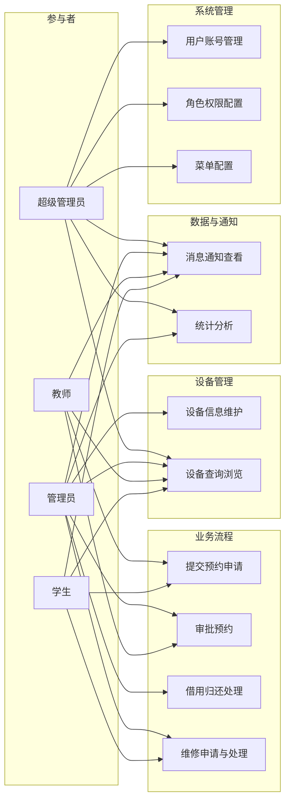
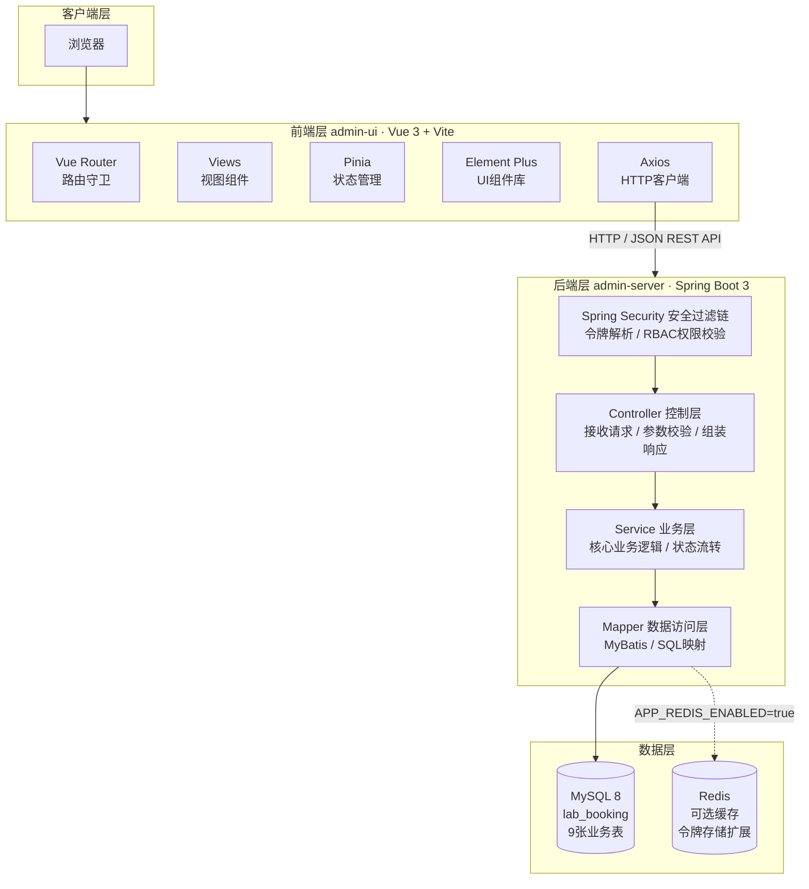
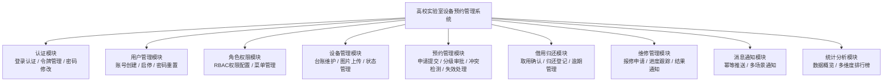
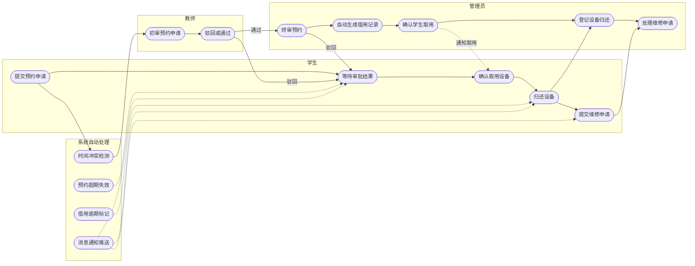
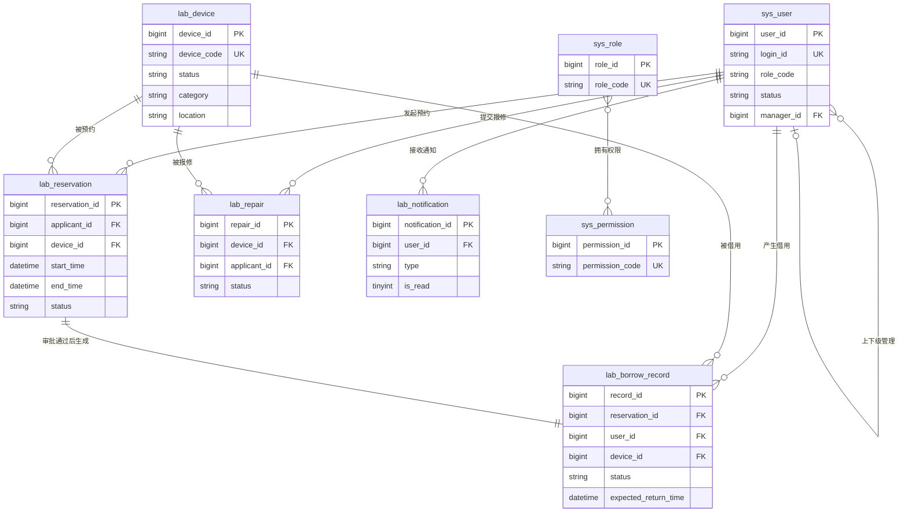
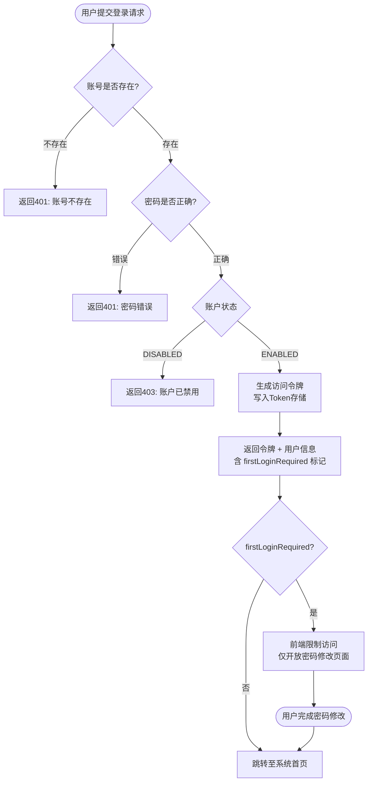
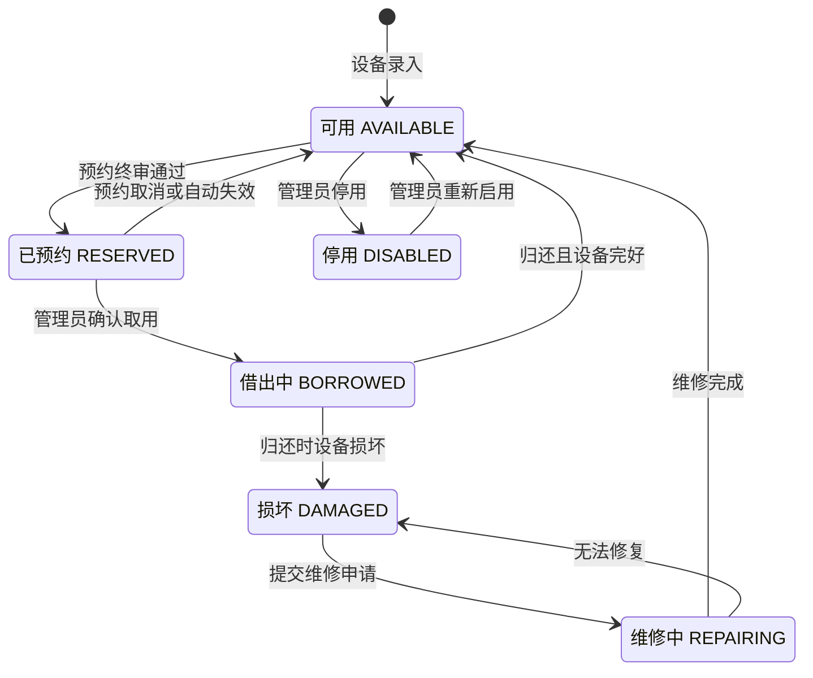
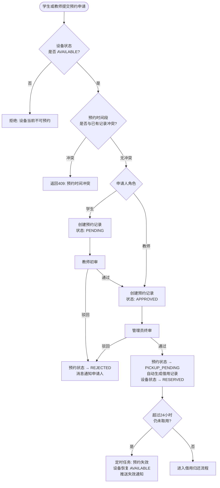
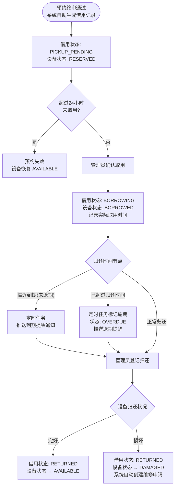
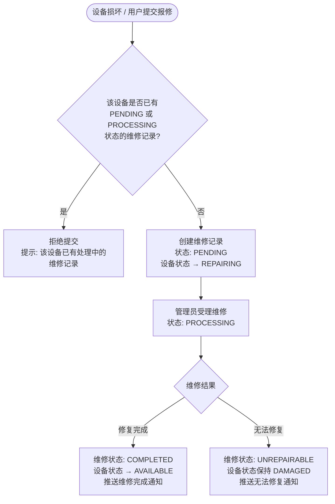

# 基于SSM框架的高校实验室设备预约管理系统设计与实现

## 摘要

高校实验室的设备管理长期面临一个现实困境：设备数量越来越多，但管理手段基本还是纸质表格和人工登记。师生常常不知道某台设备当前是否可用，管理员要翻阅记录才能确认借还情况，一旦设备损坏，责任也难以追溯。这些问题在设备种类较多、使用频率较高的实验室中尤为突出。

针对上述问题，本文开发了一套基于SSM框架（Spring + SpringMVC + MyBatis）的高校实验室设备预约管理系统。后端以Spring Boot搭建，引入Spring Security处理多角色认证与权限控制，持久化层使用MyBatis操作MySQL数据库；前端采用Vue 3与Element Plus构建管理界面，通过Vue Router实现基于角色的路由访问控制，Pinia负责全局状态管理。系统划分了超级管理员、管理员、教师、学生四种角色，功能涵盖设备台账维护、预约申请与分级审批、借用归还记录、维修流程跟踪、消息通知和统计分析，设备状态随各业务环节实时联动，形成从申请到归还的完整记录。测试结果显示各模块功能符合预期，权限边界清晰，在中小规模实验室场景下具备实际可用性。

**关键词：** 高校实验室；设备预约管理；SSM框架；前后端分离；Spring Boot；Vue 3

---

## Abstract

Managing laboratory equipment in universities is more complicated than it looks. When dozens of students and teachers share a limited set of devices, the usual approach — paper sign-in sheets and manual approval — tends to break down quickly. Reservations overlap, borrowed equipment goes untracked, and when something gets damaged, it is often unclear who is responsible. The problem is not unique to any one institution; it reflects a broader gap between how labs are actually managed and what modern information systems can offer.

This paper presents a laboratory equipment reservation management system built on the SSM framework (Spring + SpringMVC + MyBatis). The back end runs on Spring Boot, with Spring Security handling authentication and role-based access control, and MyBatis managing database operations against a MySQL backend. The front end is a Vue 3 single-page application using Element Plus for UI components, Vue Router for permission-aware navigation, and Pinia for authentication state. Four user roles are supported: super administrator, administrator, teacher, and student. The system covers equipment inventory management, reservation submission and multi-level approval, borrowing and return tracking, repair workflow, message notifications, and usage statistics. Device status updates automatically as reservations are approved, equipment is picked up, returned, or sent for repair — so the displayed status reflects the actual situation rather than lagging behind.

Testing shows that individual modules work as designed and that role boundaries hold up under cross-role access attempts. For a small-to-medium university lab with around 50–200 devices and 30–100 users, the system is a practical replacement for paper-based administration. The implementation may also serve as a reference point for similar management systems that combine a Spring Boot back end with a Vue 3 front end.

**Keywords:** University laboratory; Equipment reservation management; SSM framework; Front-end and back-end separation; Spring Boot; Vue 3; RBAC access control

## 第1章 引言

### 1.1 研究背景和意义

#### 1.1.1 研究背景

高校实验室是开展实践教学与科学研究的重要场所，设备管理水平直接影响实验课程的正常开展。随着"双一流"战略推进，各高校持续投入实验室建设，设备数量和种类逐年增加，管理工作的复杂程度也随之上升。与此同时，我国许多高校的实验室管理仍停留在纸质台账和Excel表格阶段，信息化建设明显落后于实际需求。

从具体操作层面来看，这套传统做法暴露出几个难以回避的问题。师生查询设备是否可借时，往往需要直接联系管理员，得到的答复也未必准确，因为纸质记录并不能反映实时状态；设备出借后如果没有定期催还，逾期情况很容易被漏掉；归还时若发生损坏，责任认定全靠管理员记忆或手写备注，一旦记录缺失就很难处理；维修申请走的是线下口头流程，进展如何申请人并不知道。这些问题单独看都不算大，但叠加起来，对管理员来说工作量实际上相当繁琐。

在教育部推进信息化建设的背景下，将实验室设备管理纳入统一的数字化平台已是较为明确的方向[1]。开发一套针对设备预约、借还和维修的管理系统，有助于把原本分散的人工操作转移到系统上，既能减少管理员的重复劳动，也方便师生随时查看设备状态和自己的借用记录。

#### 1.1.2 研究意义

从实际使用的角度看，本系统最直接的价值是把管理员从大量重复性手工操作中解放出来。设备信息统一录入系统后，师生可以自行查询可用状态，无需每次打电话询问；预约、借用和归还均在线完成，记录自动生成，不依赖人工补录。责任追溯也因此变得清晰——每条借用记录都关联具体用户，归还时的设备状况有文字记录，出现问题时不需要回忆。

统计分析模块虽然并非核心功能，但在实际运营中有一定用处。设备借用频率、损坏次数这类数据积累下来，可以为采购优先级和维护计划提供参考，比纯靠经验判断要可靠一些[2]。

在技术层面，本系统采用Spring Boot + MyBatis与Vue 3 + Element Plus的前后端分离架构，是目前高校管理信息系统中较为主流的技术组合。系统的设计和实现过程对类似项目具有一定的参考价值，尤其是在多角色权限控制和业务流程状态管理方面，做了相对完整的工程实践。

### 1.2 国内外研究现状

#### 1.2.1 国外研究现状

国外高校和研究机构在实验室信息化管理上起步较早，近年来研究重心已明显从基础的数字化预约转向物联网和人工智能融合方向。

Aly等人于2024年提出了一种面向高校化学实验室的IoT管理系统，通过传感器网络持续监测温湿度和有害气体浓度，并将环境数据与预约调度模块结合，兼顾了安全管理和设备调度两方面需求[3]。Zhu等人同年发表了基于AIoT技术的智能实验室管理系统，除环境监控外，还引入了用电数据分析和视频异常检测，通过AI算法对资源分配和异常情况进行预判[4]。Liu等人于2025年针对生物实验室提出了一套包含人员行为识别和安全传输的全流程监督系统[5]。从商业产品角度看，Thermo Fisher的iLab平台已将设备预约、采购审批和数据分析整合在同一平台，代表了该领域集成化发展的方向[6]。

这些研究在技术上已经相当超前，但共同的问题是建设成本较高、技术门槛不低。对于国内一般规模的高校实验室而言，直接采用这类方案并不现实，更务实的做法是根据自身规模选用合适的轻量级系统。

#### 1.2.2 国内研究现状

国内高校实验室信息化的研究在近几年产出明显增加，技术路线也逐渐向主流的前后端分离架构靠拢。

杨萍萍等人于2023年尝试用低代码平台构建实验室预约系统，核心出发点是缩短开发周期、降低后期维护成本，对于没有专职开发人员的高校来说这条路确实值得考虑[7]。赵等人则从大数据处理的角度切入，探讨了如何对设备使用记录进行聚合分析，为资源配置决策提供数据依据[8]。秦艳姣等人在教育数字化背景下讨论了高校智慧实验室的建设方向，指出移动端支持和物联网接入是下一步发展的重点[2]。

总体而言，Spring Boot + Vue的前后端分离方案已成为新建高校管理系统的常见选择。不过，现有研究中针对多角色分级权限和跨模块业务闭环的完整实现方案并不多见，部分系统在预约-借用-维修的流程联动上设计较为简化。本文在参考上述工作的基础上，重点在权限控制粒度和业务状态联动两个方面做了较为完整的设计。

### 1.3 主要内容和工作安排

#### 1.3.1 主要研究内容

本文围绕高校实验室设备预约管理的核心业务需求，以SSM框架为技术基础，设计并实现了一套功能较为完整的设备预约管理系统。主要研究内容如下：

（1）系统需求分析。从高校实验室设备管理的实际场景出发，梳理功能性和非功能性需求，确定四类角色的操作权限与业务边界，以及系统应覆盖的核心模块范围。

（2）系统架构与数据库设计。采用前后端分离架构完成系统整体设计，包括后端分层架构、RESTful接口规范，以及数据库表结构与实体关系设计。

（3）核心功能模块实现。分模块实现认证权限、设备管理、预约审批、借用归还、维修跟踪、消息通知和统计分析，形成从申请到归还的完整业务链路。

（4）系统测试。对各模块进行功能测试和越权验证，核查业务逻辑的正确性、状态流转的一致性和权限边界的有效性。

#### 1.3.2 工作安排

本文共分七章。第1章介绍研究背景，梳理国内外现状，说明选题动机。第2章介绍系统采用的主要技术框架，包括SSM后端技术栈、Spring Security、Vue 3体系和数据库方案。第3章进行需求分析，明确四类角色的操作范围，以及各模块的功能与非功能要求。第4章完成系统架构、数据库设计和接口规范设计。第5章分模块介绍各功能的后端实现思路和前端页面设计。第6章汇报测试过程和结果。第7章总结工作，指出已知不足并提出改进方向。

## 第2章 相关技术介绍

本章介绍系统开发所采用的主要技术框架与工具，包括后端SSM技术栈（Spring + SpringMVC + MyBatis）及Spring Boot工程化实践、安全认证框架Spring Security、前端Vue 3技术体系，以及数据库与缓存方案选型。

### 2.1 SSM框架概述

SSM是Java Web开发中常见的技术组合，由Spring、Spring MVC和MyBatis三部分构成。三者职责不同：Spring管理对象的创建和依赖关系，Spring MVC处理HTTP请求的接收和响应，MyBatis负责数据库操作。搭配使用时，代码按层分工，结构相对清晰[15]。

本系统以SSM为基础，但实际开发时使用Spring Boot来简化配置。传统SSM项目往往需要大量XML配置文件，Spring Boot的自动装配机制把这部分工作省去了大半，项目启动和部署也更方便。后端按照Controller、Service、Mapper三层组织代码：Controller层对外暴露接口，接收请求参数并返回响应；Service层处理业务逻辑，比如审批状态流转和设备状态更新；Mapper层通过MyBatis与MySQL交互，负责数据读写。这种分层方式并不复杂，但在多人开发和后期修改时能有效减少代码之间的相互影响。

### 2.2 Spring框架

Spring最核心的特性是IoC（控制反转）和DI（依赖注入）。简单说，就是对象不需要自己创建依赖的组件，而是由Spring容器负责装配。这样做的好处是代码之间的耦合更松——修改一个组件不容易连带影响其他部分。在项目规模比较小的时候，这个好处不太明显，但随着模块增多，维护起来确实会省不少力气。

Spring还支持AOP（面向切面编程），可以把事务管理、日志等与业务无关的逻辑抽出来单独处理。本系统中，数据库事务控制主要依赖这个机制——在涉及多表联动更新（比如审批通过后同时更新预约状态和创建借用记录）的操作上，通过声明式事务保证要么全部成功、要么全部回滚。

### 2.3 Spring MVC

Spring MVC基于MVC（Model-View-Controller）模式，通过DispatcherServlet统一接收HTTP请求，再根据URL映射分发到对应的Controller方法处理[17]。

由于本系统前后端完全分离，后端不负责页面渲染，Spring MVC在这里的作用主要是接口层的组织管理。Controller方法接收前端发来的JSON参数，调用Service处理后把结果序列化成JSON返回。`@RequestBody`和`@RequestParam`负责参数绑定，`@Valid`做入参校验，`@RestControllerAdvice`统一处理异常——这些注解组合起来，避免了在每个接口里重复写参数校验和错误响应的样板代码。

### 2.4 MyBatis框架

MyBatis是一个轻量级的Java持久层框架，核心做的事是把SQL语句和Java方法对应起来。与Hibernate这类全自动ORM不同，MyBatis不会自动生成SQL，需要开发者自己写查询语句。这样做的代价是代码量稍多一些，但好处是SQL完全可控，对于需要多表关联或者有性能要求的查询，能更精确地优化[16]。

本系统用MyBatis通过Mapper接口加XML映射文件的方式操作数据库，覆盖用户、设备、预约、借用、维修、通知等各表的增删改查。ResultMap负责数据库字段和Java对象属性之间的映射，避免了手工逐字段赋值。预约冲突检测需要查询某设备在指定时间段内是否存在有效预约，这类条件较灵活的查询用动态SQL处理起来比较方便。

### 2.5 Spring Security

Spring Security是Spring生态中处理认证和授权的框架，提供请求过滤、权限判断和安全上下文管理等功能。

本系统的权限设计基于RBAC（基于角色的访问控制）模型，将权限挂在角色上而不是直接分配给用户[11]。认证方式采用无状态令牌：用户登录后服务端返回一个令牌字符串，后续每次请求在请求头中携带该令牌，后端通过`OncePerRequestFilter`解析令牌、还原用户身份，并写入`SecurityContextHolder`供本次请求全局使用。这种方式不需要在服务端维护会话，在实现分布式扩展时更方便[18]。

系统定义了SUPER_ADMIN、ADMIN、TEACHER、STUDENT四个角色，各角色在设备管理、预约审批、借还操作等功能上的权限边界在过滤器层和业务层分别做了控制。过滤器负责拦截非法令牌请求，业务层负责数据可见范围的校验（例如教师只能审批自己管辖学生的预约），两层配合才能覆盖越权访问的各种情形。

### 2.6 前端技术

#### 2.6.1 Vue 3

Vue 3是尤雨溪主导开发的渐进式前端框架，特点是组件化开发和响应式数据绑定。相比Vue 2，引入了Composition API，允许把相关逻辑集中在一起，而不是分散在data、methods、computed等选项里，对于功能较复杂的页面而言代码会更好维护。

本系统前端完全基于Vue 3构建，包括登录页、设备管理、预约管理、借用归还、维修管理、消息中心和统计分析页面。各页面按功能拆成独立组件，查询筛选区、列表区和弹窗表单可以在不同模块之间复用，减少了重复代码。

#### 2.6.2 Vite

Vite是基于原生ES模块的前端构建工具，开发阶段启动速度很快，热更新几乎是即时的，比Webpack的开发体验要好不少。

本系统用Vite的主要原因是它内置了代理功能，把`/api`路径转发到`http://localhost:8081`，这样前端开发时不需要额外处理跨域问题，前后端可以并行开发。

#### 2.6.3 Element Plus

Element Plus是面向Vue 3的桌面端UI组件库，提供表单、表格、分页、弹窗等常用组件，适合快速搭建管理后台[12]。

本系统界面全部基于Element Plus构建。设备列表用ElTable加分页展示，预约审批操作用ElDialog弹窗，消息角标用ElBadge，统计页面用ElCard排列数据卡片。使用统一的组件库的好处是不用单独写样式，各页面视觉风格自然一致。

#### 2.6.4 Vue Router与Pinia

Vue Router负责单页应用中的路由管理。本系统用`router.beforeEach`全局守卫拦截每次页面跳转，在路由的`meta`字段中声明允许访问的角色列表（`meta.roles`）和是否允许首次登录访问（`meta.allowFirstLogin`），守卫读取这些元数据来决定是放行、跳转登录页还是跳转403页面。把权限声明写进路由配置的好处是逻辑集中，添加新页面时只需要在路由定义里注明角色要求，不需要在页面组件里单独处理。

Pinia是Vue 3推荐的状态管理方案，语法比Vuex简洁很多。系统里用`useAuthStore`存令牌、角色和用户信息，登录时写入`localStorage`，页面刷新后能自动恢复状态；`useMenuStore`维护当前用户可见的菜单列表，侧边导航根据这份列表动态渲染，不同角色登录后看到的菜单项自然就不同。

### 2.7 数据库与缓存技术

#### 2.7.1 MySQL

MySQL是使用最广泛的开源关系型数据库之一，InnoDB引擎支持行级锁和ACID事务，适合有并发写入需求的业务系统[16]。

本系统使用MySQL 8，数据库名`lab_booking`，共9张表，覆盖用户权限、设备、预约、借用、维修和通知六个业务域。设备编号、登录标识等字段设置了唯一约束，防止重复录入；预约记录和借用记录之间通过外键关联保证引用完整性；对`login_id`、`device_code`、`status`等高频查询字段建了索引，避免全表扫描。

#### 2.7.2 Redis

Redis是基于内存的键值数据库，读写延迟极低，通常用于缓存和会话存储。

本系统默认不启用Redis，令牌存储使用内存实现（`InMemoryTokenStore`），单节点部署时足够稳定。通过环境变量`APP_REDIS_ENABLED`可以切换到`RedisTokenStore`，这样多个服务节点之间可以共享令牌，支持水平扩展。统计分析接口的概览数据在Redis开启时会被缓存，避免每次请求都重新扫描全表。对于目前的目标场景（中小规模高校实验室），Redis处于可选状态，不影响主要功能的运行。

---

## 第3章 系统需求分析

### 3.1 总体需求分析

#### 3.1.1 建设背景

实验室设备的管理水平直接影响到实验课程能否顺利开展，以及设备资源能否被合理使用。研究指出，设备管理信息化程度已成为衡量高校教学保障能力的一项参考维度，管理规范性也关系到设备的使用寿命[15]。然而在实践中，相当比例的高校仍在用纸质登记和电话沟通处理设备借还，信息化程度明显不足[1]。

具体来说，当前管理方式暴露出几个实际问题：设备当前是否可借用，师生只能向管理员询问，无法自行查询；预约、审批、取用、归还各环节在不同表格或口头确认中进行，管理员很难做到全程跟踪；借用记录一旦缺失，损坏责任就难以认定；维修进度对申请人而言是个黑盒，不知道何时能恢复使用。

将这些流程整合到一个统一的系统中，是解决上述问题的直接路径。设备信息、预约审批、借还记录和维修跟踪在同一平台管理，数据互通，状态实时更新，可以减少管理员重复劳动，也能让师生随时了解设备情况和自己的借用状态，推动实验室管理走向规范化[2]。

#### 3.1.2 系统总体目标

本系统的目标是替代纸质管理流程，把设备台账、预约审批、借用归还和维修跟踪统一放到一个平台上管理。
具体来说：
（1）四类角色的权限边界要清晰，各自的操作范围互不干扰；
（2）设备状态必须实时准确，不能出现"显示可用但已被借走"的情况；预约→审批→借用→归还→维修这条主线要走通；
（3）数据要能串起来；关键事件（预约失效、逾期未还、维修结果）要有通知机制，让用户不用主动去查；
（4）统计功能提供基本的概览数据供管理员参考；系统要能在单节点稳定运行，结构上留有扩展的余地。

#### 3.1.3 系统角色分析

根据系统业务特点与实验室管理实际需求，本系统设定四类用户角色，分别为超级管理员、管理员、教师和学生。不同角色在系统中承担的职责存在明显差异，其权限划分如表3-1所示。

**表3-1 系统角色及职责划分**

| 角色       | 角色代码    | 主要职责                                                       |
| ---------- | ----------- | -------------------------------------------------------------- |
| 超级管理员 | SUPER_ADMIN | 负责系统全局管理，包括管理员账号管理、角色权限配置、菜单管理等 |
| 管理员     | ADMIN       | 负责设备管理、预约终审、借用归还处理、维修管理及统计分析       |
| 教师       | TEACHER     | 负责学生预约初审、学生账号管理及个人业务操作                   |
| 学生       | STUDENT     | 负责设备查询、预约申请、消息查看及个人借用信息管理             |

四个角色形成一条管理链：超级管理员管系统配置，管理员管业务流程，教师管自己负责的学生，学生是设备的实际使用者。这个层级和高校实验室实际的组织结构基本对应。系统四类角色与各功能用例的对应关系如图3-1所示。

**图3-1 系统用例图**



### 3.2 功能需求分析

#### 3.2.1 用户认证与账户管理需求

登录时四类角色走同一个入口，后端根据提交的登录标识（学号/工号/管理员编号）查用户，依次校验账号存在、密码正确、账户未禁用，都过了才返回令牌。有一步校验失败就返回对应的错误状态，不给进。

新建账号的默认密码是`000000`，这个密码如果长期不改有安全隐患。所以首次登录成功后系统会检测`firstLoginRequired`标记，如果为`true`就限制访问，只放行个人中心和改密接口，其他业务接口都返回403。等密码改了这个限制自动解除。

账号管理按层级走：超级管理员管理员账号，管理员管理教师账号，教师管理学生账号，都支持创建、启用禁用和密码重置。层级是单向的，不能跨级操作，也不能管理同级或上级的账号。

#### 3.2.2 角色与权限管理需求

四类角色的操作范围差异很大，这就要求权限控制必须足够细。超级管理员可以管理员账号，但不应该去操作普通设备借还；学生能提交预约，但不能动设备信息或审批别人的申请。这种边界如果靠代码里手动判断角色来维护，容易出漏洞，也难以调整。

更合理的做法是把权限挂在角色上，角色再分配给用户。系统需要支持超级管理员在权限配置页面查看每个角色当前有哪些权限，并能做调整，粒度覆盖到"设备新增""预约审批""维修处理"等具体操作。权限改了之后，下次请求就应该生效，不需要重启服务。

菜单和权限是分开管理的。菜单控制的是导航栏里能看到哪些入口，权限控制的是接口是否放行。两者需要独立配置——不能因为看不到菜单就认为接口也被限制了，也不能因为菜单可见就默认拥有了对应接口的权限。导航菜单根据用户角色动态渲染，无权访问的入口直接隐藏，减少用户看到无关选项的干扰。

#### 3.2.3 设备管理需求

设备是整个系统的核心数据来源，其他所有业务——预约、借用、维修——都依赖设备信息的准确性。台账需要维护设备名称、编号、类别、状态、存放位置、图片和描述这几个字段，管理员可以新增、编辑和停用设备。设备编号要加唯一约束，录入时系统自动校验，避免同一台设备因笔误被录入两次。图片支持文件上传，在设备详情弹窗里展示，对于不熟悉设备的学生来说比较实用。

设备状态是这个模块里最需要仔细设计的部分。状态不能是一个人工填写的字段，而必须由业务操作驱动：预约审批通过→已预约，管理员确认取用→借出中，归还完好→可用，归还损坏→损坏，提交维修申请→维修中，维修完成→可用。每次业务操作后状态立即更新，不依赖人工修改。这样做的意义在于，师生查询设备列表时看到的状态是实时的，不会出现"显示可用但实际已被借走"的情况。

查询方面，支持按名称关键字、编号关键字、类别和状态组合筛选，结果分页返回。对于设备数量不多的实验室，这个功能看起来不起眼，但当设备超过一百台时，没有筛选功能会让管理员很头疼。

#### 3.2.4 预约管理需求

预约申请由学生或教师发起，需要填写目标设备、预约时间段和使用目的。提交前系统要做一件必须做的事：检查时间冲突。同一设备在某个时间段已有有效预约的话，新申请如果时间重叠就应该被拒绝，并告诉用户具体冲突在哪里，让他调整时间再提交。这个检测如果漏掉，两个人都拿着审批通过的预约来取设备，管理员就很难处理。

审批流程因申请人角色不同而有所区别。学生的申请需要先经过所属教师审核，教师通过后再到管理员终审；教师自己的申请则直接进入管理员终审，省掉中间那层。驳回时必须填写审批意见，不能只点一个"拒绝"按钮什么都不说，否则申请人不知道该怎么改。

终审通过后，系统自动生成借用记录，设备状态变为"已预约"。在正式取用之前，申请人还可以主动取消预约，设备状态随之释放。另一个需要处理的场景是：有人的预约通过了，但迟迟没来取。这种情况应该通过定时任务检测，超过24小时未取用就标记为失效，同时通知申请人，让设备重新进入可预约状态。

#### 3.2.5 借用归还管理需求

预约终审通过后，系统自动生成借用记录，初始状态为"待取用"，记录借用人、设备、关联预约和预计归还时间。用户实际来取设备时，管理员在系统里确认取用，记录实际取用时间，设备状态更新为"借出中"。这个确认步骤是必须的——不然系统不知道设备到底有没有被取走。

归还时，管理员录入设备状况（完好或损坏）。完好就直接恢复为可用；如果归还时发现损坏，系统把设备状态更新为损坏，并自动创建一条维修申请，不需要管理员再手动操作。归还时填写的状况说明字段是日后追责的依据，如果空着不填，发生纠纷时就很难说清楚是谁弄坏的。

逾期的处理依赖定时任务。每隔一段时间扫描所有借用中的记录，超过预计归还时间还没归还的，状态改为逾期，同时推送提醒给借用人。临近到期的借用也应该提前提醒，给借用人一点缓冲时间，不至于突然发现已经逾期了。

#### 3.2.6 消息通知需求

系统里有几个节点必须主动告知用户，否则用户完全不知道发生了什么：首次登录时要提醒修改密码；管理员重置密码后要通知用户；预约因超时未取用被自动失效，申请人需要知道；借用临近到期和已经逾期都要推送提醒；维修进度有更新时要通知申请人结果。这六类通知覆盖了大部分用户需要关注的事件。

通知在消息中心里集中查看，按时间倒序排列，未读和已读状态分开显示，用户点击确认后记录阅读时间。顶部导航栏的消息图标旁显示未读数角标，不进消息中心也能看到有几条待看的消息。

有一个细节需要处理：定时任务每次执行都会扫描逾期记录，如果不做去重，用户每半小时就收到一条"您的设备已逾期"，体验很差。所以在生成通知前要先检查该用户对应该业务对象是否已有同类未读通知，有的话就不重复推送。

#### 3.2.7 维修管理需求

设备损坏后，用户可以在系统里提交维修申请，填写是哪台设备、故障情况是什么。申请提交后设备状态立即改为"维修中"，期间不可被预约或借用。同一台设备如果已有处理中的维修记录，重复提交应该被拒绝，免得出现两条针对同一设备的并行维修记录。

管理员在收到申请后，可以把状态从"待处理"改为"处理中"，表示已经安排人去处理了。处理完成后有两种结果：修好了就标记为"已完成"，设备状态恢复可用；实在修不了就标记为"无法修复"，设备保持损坏状态，后续停用还是报废由管理员决定。每次更新状态时管理员要填写处理说明，这条说明会推送给申请人，让他知道结果。

这个流程解决的是一个实际问题：以前设备坏了，用户就口头告诉管理员，管理员可能记得也可能忘记，没有任何书面记录。现在有了系统记录，每一步都有时间戳，结果有文字说明，双方都清楚发生了什么。

#### 3.2.8 统计分析需求

统计分析主要服务于管理员，目的是让他们不用翻每一条业务记录就能了解整体情况。首页概览区用数据卡片展示几个关键数字：设备总量、当前可用数、借用中数量，以及预约总量、借用总量和维修总量。这些数字在登录后第一眼就能看到，不需要专门去查。

排行榜有三类：热门设备榜按借用次数排，损坏次数多的设备排在损坏榜前面，逾期次数或损坏归还次数多的用户出现在违规榜里。三类榜单都支持切换时间维度（全部、近半年、近一个月），也可以选择显示前3、前5还是前10名。热门设备榜能帮助管理员判断哪些设备需要重点维护，损坏榜能识别质量问题比较集中的设备，违规榜则为信用管理提供数据依据。

这些统计都是从历史业务记录里实时计算的，没有额外维护独立的统计表，数据准确但在记录量大时性能会有影响，这是一个已知的权衡。

### 3.3 非功能需求分析

非功能需求约束的是系统"怎么做"而不是"做什么"，主要涉及安全、数据一致性、性能、可扩展性和可维护性。

#### 3.3.1 安全性需求

安全方面的基本要求有三层。

访问控制：没有令牌或令牌无效的请求，一律返回401拒绝，不管请求的是哪个接口。有令牌但角色不够的请求返回403。这两个检查放在过滤器层统一处理，不依赖每个接口自己去判断[11]。

密码存储：用BCrypt哈希后再入库，不存明文。首次登录必须改密码，避免所有人都用"000000"这个默认密码的情况长期存在。

数据访问范围：不是每个人都能看到所有数据。教师只能看到自己管辖学生的记录，学生只能查自己的借用记录。这个控制在业务层做，过滤器只管令牌合法性，不管数据归属。

#### 3.3.2 数据一致性需求

预约审批通过这个操作，实际上要改三张表：预约记录状态、借用记录新增一行、设备状态更新。如果中间某步出错，比如借用记录写入失败但设备状态已经改了，数据就乱了。关键业务操作必须放在事务里，保证要么全部成功，要么全部回滚，不留中间状态[16]。

数据库层面也要做好约束：设备编号唯一约束防止重复录入，状态字段用枚举值限制范围，外键保证关联记录的完整性。

#### 3.3.3 可用性与性能需求

系统面向的是中小规模实验室，设备约50至200件，用户约30至100人。在这个数量级下，核心接口响应时间控制在500毫秒以内是合理目标。列表类接口要分页，不能一次全部加载——设备列表如果有200条，一次性返回对前端渲染和后端查询都有压力。异常处理要统一，一个接口抛出未捕获异常不能影响其他请求。

#### 3.3.4 可扩展性需求

系统现阶段面向的是单节点部署场景，但架构上不应该写死一些东西。后端接口设计为无状态，令牌存储通过环境变量控制切换，这样将来扩展到多节点时改动量最小。各模块之间通过接口交互，不直接依赖对方的实现类，加新功能时不需要改动已有模块[2]。前端组件化开发，新增页面不影响已有页面结构。

#### 3.3.5 可维护性需求

分层架构的职责边界要清晰：Controller不写业务逻辑，Service不写SQL，Mapper不处理权限校验。接口响应格式统一，错误码有标准，前端看到错误码就知道是什么问题，不用每次去翻后端代码。数据库连接、Redis开关这类配置项通过环境变量管理，切换环境时改配置不改代码。

# 第4章 系统设计

本章说明系统的整体架构选型、功能模块划分、数据库表结构设计和接口规范，是需求分析转向具体实现的中间层。架构和数据库设计决定了后续代码的基本结构，提前想清楚模块之间的边界和数据关系，可以减少实现阶段的返工。

## 4.1 系统架构设计

本系统采用前后端分离的B/S架构，前端跑在浏览器里，后端提供RESTful接口，两者通过HTTP交换JSON数据[17][19]。这种架构的好处是前后端可以独立开发，接口定好了各自写各自的，互不阻塞。

后端内部按三层组织：Controller接请求、做参数校验；Service处理业务逻辑，审批流转、状态联动这些都在这一层；Mapper负责和数据库打交道。三层之间依赖接口而不是具体实现，换一个Mapper实现不需要改Service代码。每次HTTP请求在进入Controller之前，Spring Security的过滤链先跑一遍，解析令牌、提取用户身份，写入安全上下文，后续业务代码直接读就行。

数据层用MySQL存业务数据，Redis作为可选扩展——默认关闭，需要多节点部署或者想给统计接口加缓存时可以开启。系统整体架构如图4-1所示。

**图4-1 系统整体架构图**



## 4.2 功能模块设计

根据系统需求分析结果，结合高校实验室设备管理的业务特点，系统主要划分为认证登录、用户管理、角色权限管理、设备管理、预约管理、借用归还管理、维修管理、消息通知管理、统计分析和菜单配置等功能模块。

各功能模块的职责如下：认证登录处理用户登录、令牌管理和密码修改；用户管理负责账号创建、状态控制和密码重置；角色权限管理维护各角色的功能权限和菜单可见范围；设备管理维护台账信息和状态；预约管理处理申请提交、分级审批、取消和超时失效；借用归还管理从取用确认到归还登记再到逾期标记；维修管理处理报修申请和进度跟踪；消息通知在各业务节点推送提醒；统计分析提供概览数据和排行榜。

各模块之间存在依赖关系，不是完全独立的：预约模块需要查设备状态，审批通过后触发借用记录创建，归还时如果损坏自动触发维修申请，消息通知模块被多个模块调用。系统功能模块划分如图4-2所示。

**图4-2 系统功能模块图**



各角色在核心业务流程中的协作关系如图4-3泳道图所示，完整描述了设备从预约申请到归还维修的全生命周期流转过程。

**图4-3 核心业务流程泳道图**



## 4.3 界面设计

前端界面基于Element Plus组件库构建，面向多角色用户，不同角色看到的菜单和操作按钮有所不同[12]。

### 4.3.1 整体布局设计

整体采用后台管理系统常见的三栏布局：左侧固定侧边栏、顶部操作栏、右侧主内容区。侧边栏根据当前用户角色动态渲染，角色无权访问的菜单入口直接不显示，不是灰掉而是不渲染。顶部显示用户名、角色标签和未读消息角标，点角标跳消息中心，右上角有退出登录入口。主内容区通过`<RouterView>`切换页面，切换时侧边栏和顶栏不重新渲染，只换中间内容区[12]。

### 4.3.2 登录页面设计

登录页只有一个：系统标题、登录标识输入框（学号/工号/管理员编号都走这里）、密码框和登录按钮。四类角色都用同一个入口，后端根据`login_id`或`account`字段查用户，校验完返回令牌和角色，前端跳到对应的默认首页。

首次登录时，后端响应里会带一个`firstLoginRequired=true`，前端弹出提示让用户去改密码，路由守卫也会拦截业务页面，只放行个人中心和密码修改两个入口。等密码改完，这个限制自动解除。

### 4.3.3 设备管理页面设计

页面上半部分是筛选区，支持按名称关键字、编号关键字、类别、状态组合查询，条件变化后自动刷新列表。下半部分是`ElTable`分页表格，显示编号、名称、类别、状态、位置和操作按钮。状态字段用`ElTag`颜色区分：可用绿色、借出橙色、维修中蓝色、损坏红色、停用灰色。这样扫一眼就能看出哪些设备有问题。

新增和编辑用弹窗表单，不做页面跳转。表单提交前校验必填项，设备编号如果重复会有提示。图片支持URL输入或文件上传，详情弹窗里有图片预览[9]。

### 4.3.4 预约管理页面设计

这个页面的内容根据角色不同会有差别。学生看到的主要是自己的预约记录和新建预约表单，提交时如果时间冲突，接口返回409后前端给出提示，让用户换时间。教师除了自己的预约记录，还能看到待初审的学生申请列表，对每条申请执行通过或驳回，驳回必须填意见。管理员看到的是待终审队列，处理逻辑和教师侧类似。

预约详情弹窗里展示申请人、设备、时间段、使用目的和历次审批意见，审批人看到这些信息就能判断是否合理[11]。

### 4.3.5 借用归还页面设计

借用归还页面供管理员操作。列表支持按状态（待取用、借用中、已归还、逾期）筛选，操作按钮根据当前记录状态动态启用——"确认取用"只对待取用状态生效，"登记归还"只对借用中状态生效，避免点错。

归还时弹窗要求填设备状况，选"损坏"提交后，系统自动把设备状态改成`DAMAGED`并创建维修申请，管理员不需要再去维修模块单独操作一遍[9]。

### 4.3.6 消息中心页面设计

消息按时间倒序展示，每条消息有标题、正文、类型标签和时间。未读消息通过字体加粗或背景色与已读区分，点击确认后记录已读时间。顶部导航栏的消息角标显示未读数，进入消息中心或有新业务操作完成后角标数量刷新。

### 4.3.7 统计分析页面设计

统计分析页面只有管理员能访问[7]。上半部分是概览卡片区，用`ElCard`网格展示六项指标：设备总量、可用数、借用中数、预约总量、借用总量、维修总量。数字直接显示在卡片正中，一眼就能扫完。

下半部分是三个排行榜：热门设备榜（按借用次数）、损坏榜（按维修次数）、用户违规榜（按逾期和损坏归还次数）。每个榜支持切换时间范围（全部/近半年/近一个月）和展示数量（前3/5/10），用表格加序号展示。

## 4.4 数据模型设计

### 4.4.1 概念模型设计

为保证系统业务数据能够被规范存储和高效管理，本系统采用关系型数据库进行数据建模，数据库名称为`lab_booking`。在进行物理表结构设计之前，系统先行完成了概念层面的实体关系（E-R）分析，明确各业务实体的核心属性及其相互关联方式，为后续表结构的细化设计提供逻辑依据。

系统涉及以下主要业务实体。

用户（sys_user）是基础数据，存姓名、登录标识、角色编码、账户状态和密码。`manager_id`字段做自关联，记录上下级管理关系，用来实现超级管理员—管理员—教师—学生这条管理链。

角色（sys_role）和权限（sys_permission）组合起来实现RBAC。两者通过`sys_role_permission`关联表绑定。这样的好处是调整某个角色的权限时只改关联表，不需要动角色表或权限表。

设备（lab_device）是整个业务的核心对象。`device_code`加了唯一约束防重录，`status`字段不是人工维护的，由各业务操作驱动更新。

预约记录（lab_reservation）记录从提交到审批完成的全过程，`status`字段跟着流程走，审批意见存在`review_comment`里，驳回时必填。

借用记录（lab_borrow_record）在预约终审通过后自动生成，与预约记录一对一关联。`device_condition`记录归还时的设备状况，是归还操作中比较重要的一个字段——填了"损坏"后续会触发维修流程。

维修记录（lab_repair）和消息通知（lab_notification）相对独立。维修记录跟踪设备损坏处理进度，一台设备可以有多条历史维修记录；通知表存各类推送消息，`related_biz_type`和`related_biz_id`关联触发通知的业务记录，方便前端点击跳转查看详情。

整体关系上，User和Device是两个核心实体，预约、借用、维修、通知四张业务表都向它们多对一关联，预约和借用之间是严格的一对一约束。系统核心数据模型的E-R图如图4-4所示。

**图4-4 数据库E-R图**



### 4.4.2 数据库表设计

数据库`lab_booking`共9张表，覆盖用户权限、设备、预约借还、维修和通知五个业务域，表结构说明如下。

（1）sys_user（用户表）

存系统所有账户数据。`login_id`是登录标识（学号/工号/管理员编号），`manager_id`记上下级关系，`first_login_required`标记首次改密状态，`deleted`做逻辑删除。

**表4-1 sys_user 用户表**

| 字段名               | 数据类型     | 约束             | 字段说明                                      |
| -------------------- | ------------ | ---------------- | --------------------------------------------- |
| user_id              | BIGINT       | 主键             | 用户唯一标识                                  |
| name                 | VARCHAR(64)  | NOT NULL         | 用户真实姓名                                  |
| account              | VARCHAR(64)  | UNIQUE           | 系统账号（可选）                              |
| login_id             | VARCHAR(64)  | UNIQUE, NOT NULL | 登录标识（学号/工号/编号）                    |
| phone                | VARCHAR(20)  |                  | 手机号码                                      |
| role_code            | VARCHAR(32)  | NOT NULL         | 角色编码（SUPER_ADMIN/ADMIN/TEACHER/STUDENT） |
| status               | VARCHAR(16)  | NOT NULL         | 账户状态（ENABLED/DISABLED）                  |
| credit_score         | INT          |                  | 信用积分                                      |
| password             | VARCHAR(255) | NOT NULL         | BCrypt 加密后的密码                           |
| first_login_required | TINYINT(1)   | NOT NULL         | 是否需首次修改密码（1=是）                    |
| manager_id           | BIGINT       |                  | 上级管理者用户ID                              |
| deleted              | TINYINT(1)   | NOT NULL         | 逻辑删除标记（1=已删除）                      |

（2）sys_role（角色表）

只存角色代码和名称，预置四类角色。权限不在这张表里，通过关联表管理。

**表4-2 sys_role 角色表**

| 字段名    | 数据类型     | 约束             | 字段说明                              |
| --------- | ------------ | ---------------- | ------------------------------------- |
| role_id   | BIGINT       | 主键             | 角色唯一标识                          |
| role_name | VARCHAR(64)  | NOT NULL         | 角色名称                              |
| role_code | VARCHAR(32)  | UNIQUE, NOT NULL | 角色编码（与用户表中 role_code 对应） |
| remark    | VARCHAR(255) |                  | 角色备注说明                          |

（3）sys_permission（权限表）

存操作级别的权限编码，如`device:create`、`reservation:approve`，是后端接口权限校验的依据。

**表4-3 sys_permission 权限表**

| 字段名          | 数据类型    | 约束             | 字段说明                     |
| --------------- | ----------- | ---------------- | ---------------------------- |
| permission_id   | BIGINT      | 主键             | 权限唯一标识                 |
| permission_code | VARCHAR(64) | UNIQUE, NOT NULL | 权限编码（如 device:create） |
| permission_name | VARCHAR(64) | NOT NULL         | 权限名称                     |
| type            | VARCHAR(32) |                  | 权限类型（如 api、page）     |

（4）sys_role_permission（角色权限关联表）

角色和权限的多对多关联表，两列组成联合主键，没有额外业务字段。

**表4-4 sys_role_permission 角色权限关联表**

| 字段名        | 数据类型 | 约束     | 字段说明                    |
| ------------- | -------- | -------- | --------------------------- |
| role_id       | BIGINT   | 联合主键 | 角色ID，关联 sys_role       |
| permission_id | BIGINT   | 联合主键 | 权限ID，关联 sys_permission |

（5）lab_device（设备表）

设备基础信息。`device_code`加唯一约束防止重复录入，`status`字段由各业务操作驱动更新，不是人工维护的。

**表4-5 lab_device 设备表**

| 字段名      | 数据类型     | 约束     | 字段说明                                                           |
| ----------- | ------------ | -------- | ------------------------------------------------------------------ |
| device_id   | BIGINT       | 主键     | 设备唯一标识                                                       |
| device_name | VARCHAR(128) | NOT NULL | 设备名称                                                           |
| device_code | VARCHAR(64)  | UNIQUE   | 设备编号                                                           |
| category    | VARCHAR(64)  |          | 设备类别                                                           |
| status      | VARCHAR(32)  | NOT NULL | 设备状态（AVAILABLE/RESERVED/BORROWED/REPAIRING/DAMAGED/DISABLED） |
| location    | VARCHAR(128) |          | 设备存放位置                                                       |
| image_url   | VARCHAR(255) |          | 设备图片存储路径                                                   |
| description | TEXT         |          | 设备描述信息                                                       |

（6）lab_reservation（预约记录表）

记录每条预约申请从提交到审批完成的全过程。`status`字段跟着流程推进，`review_comment`存驳回原因，驳回时必须填写。

**表4-6 lab_reservation 预约记录表**

| 字段名         | 数据类型     | 约束     | 字段说明                                                               |
| -------------- | ------------ | -------- | ---------------------------------------------------------------------- |
| reservation_id | BIGINT       | 主键     | 预约唯一标识                                                           |
| applicant_id   | BIGINT       | NOT NULL | 申请人用户ID，关联 sys_user                                            |
| device_id      | BIGINT       | NOT NULL | 预约设备ID，关联 lab_device                                            |
| start_time     | DATETIME     | NOT NULL | 预约开始时间                                                           |
| end_time       | DATETIME     | NOT NULL | 预约结束时间                                                           |
| purpose        | VARCHAR(255) |          | 使用目的说明                                                           |
| status         | VARCHAR(32)  | NOT NULL | 预约状态（PENDING/APPROVED/REJECTED/PICKUP_PENDING/CANCELLED/EXPIRED） |
| reviewer_id    | BIGINT       |          | 审批人用户ID，关联 sys_user                                            |
| review_comment | VARCHAR(255) |          | 审批意见                                                               |
| created_at     | DATETIME     | NOT NULL | 预约申请创建时间                                                       |

（7）lab_borrow_record（借用记录表）

预约终审通过后自动生成，与预约记录一对一关联。`device_condition`是归还时填的设备状况，填"损坏"会触发自动创建维修申请。

**表4-7 lab_borrow_record 借用记录表**

| 字段名               | 数据类型    | 约束     | 字段说明                                              |
| -------------------- | ----------- | -------- | ----------------------------------------------------- |
| record_id            | BIGINT      | 主键     | 借用记录唯一标识                                      |
| reservation_id       | BIGINT      | NOT NULL | 关联预约ID，关联 lab_reservation                      |
| user_id              | BIGINT      | NOT NULL | 借用人用户ID，关联 sys_user                           |
| device_id            | BIGINT      | NOT NULL | 借用设备ID，关联 lab_device                           |
| status               | VARCHAR(32) | NOT NULL | 借用状态（PICKUP_PENDING/BORROWING/RETURNED/OVERDUE） |
| pickup_time          | DATETIME    |          | 实际取用时间                                          |
| expected_return_time | DATETIME    |          | 预计归还时间                                          |
| return_time          | DATETIME    |          | 实际归还时间                                          |
| device_condition     | VARCHAR(64) |          | 归还时设备状况说明                                    |

（8）lab_repair（维修记录表）

设备报修记录。`status`从PENDING到COMPLETED或UNREPAIRABLE，`comment`是管理员填的处理说明，状态更新后推送给申请人。

**表4-8 lab_repair 维修记录表**

| 字段名       | 数据类型     | 约束     | 字段说明                                              |
| ------------ | ------------ | -------- | ----------------------------------------------------- |
| repair_id    | BIGINT       | 主键     | 维修记录唯一标识                                      |
| device_id    | BIGINT       | NOT NULL | 维修设备ID，关联 lab_device                           |
| applicant_id | BIGINT       | NOT NULL | 申请人用户ID，关联 sys_user                           |
| description  | TEXT         |          | 故障描述信息                                          |
| status       | VARCHAR(32)  | NOT NULL | 维修状态（PENDING/PROCESSING/COMPLETED/UNREPAIRABLE） |
| comment      | VARCHAR(255) |          | 管理员处理说明或结论                                  |
| created_at   | DATETIME     | NOT NULL | 维修申请创建时间                                      |
| updated_at   | DATETIME     |          | 最近状态更新时间                                      |

（9）lab_notification（消息通知表）

存各类业务通知，`type`区分通知类型，`related_biz_type`和`related_biz_id`关联触发这条通知的业务记录。`is_read`和`read_at`管理已读状态，前端角标用`is_read=0`的计数驱动。

**表4-9 lab_notification 消息通知表**

| 字段名           | 数据类型     | 约束     | 字段说明                                          |
| ---------------- | ------------ | -------- | ------------------------------------------------- |
| notification_id  | BIGINT       | 主键     | 通知唯一标识                                      |
| user_id          | BIGINT       | NOT NULL | 接收用户ID，关联 sys_user                         |
| type             | VARCHAR(64)  | NOT NULL | 通知类型（RESERVATION_EXPIRED/BORROW_OVERDUE 等） |
| title            | VARCHAR(128) | NOT NULL | 通知标题                                          |
| content          | TEXT         |          | 通知正文内容                                      |
| related_biz_type | VARCHAR(32)  |          | 关联业务类型标识（如 reservation、borrow）        |
| related_biz_id   | BIGINT       |          | 关联业务记录ID                                    |
| is_read          | TINYINT(1)   | NOT NULL | 是否已读（0=未读，1=已读）                        |
| created_at       | DATETIME     | NOT NULL | 通知创建时间                                      |
| read_at          | DATETIME     |          | 用户确认阅读时间                                  |

## 4.5 接口设计

### 4.5.1 接口规范设计

系统采用前后端分离架构，后端需向前端提供统一规范的接口服务。本系统后端接口整体遵循RESTful设计风格[17]，以资源为中心组织接口路径，以HTTP请求方法区分操作类型：GET用于数据查询，POST用于数据新增，PUT用于数据更新，DELETE用于数据删除。所有接口的基础路径统一为`/api`，数据传输格式统一采用JSON，时间字段统一使用`yyyy-MM-dd HH:mm:ss`格式。

**（1）认证方式**

系统采用基于令牌的无状态认证机制。用户登录成功后，后端返回令牌字符串，客户端在后续每次请求中通过HTTP请求头`Authorization: Bearer <token>`携带令牌。后端认证过滤器从请求头中提取令牌并完成身份校验，校验通过后将用户信息写入安全上下文，供后续接口处理使用。

**（2）统一响应结构**

所有接口返回统一的JSON结构，包含业务状态码`code`、提示信息`message`和业务数据`data`三个字段。其中`code`为0时表示操作成功，非0时表示业务异常。对于分页查询接口，`data`字段中包含`list`（数据列表）、`pageNum`（当前页码）、`pageSize`（每页条数）和`total`（总记录数）四个固定字段。响应结构示例如下：

```json
{
    "code": 0,
    "message": "success",
    "data": {
        "list": [],
        "pageNum": 1,
        "pageSize": 10,
        "total": 100
    }
}
```

**（3）异常响应机制**

接口层设计了统一的全局异常处理机制。对于常见异常场景，系统返回对应的HTTP状态码与业务错误码：参数校验失败返回400，未认证访问返回401，权限不足返回403，资源不存在返回404，业务状态冲突（如时间冲突、状态非法）返回409。通过统一的错误响应结构，前端能够快速定位问题原因，提升联调效率。

### 4.5.2 各模块接口设计

根据系统功能模块划分，后端接口共涵盖认证、用户管理、角色权限、设备管理、预约管理、借用归还、维修管理、消息通知和统计分析等九个模块，各模块接口说明如下。

**（1）认证模块**

认证模块接口提供用户登录、获取当前用户信息和修改密码三项功能，是系统访问控制的入口。登录接口为公开接口，其余接口均需携带有效令牌。

**表4-10 认证模块接口**

| 接口路径           | 方法 | 权限要求   | 功能说明                                     |
| ------------------ | ---- | ---------- | -------------------------------------------- |
| /api/auth/login    | POST | 公开       | 用户登录，返回令牌及用户基本信息             |
| /api/auth/me       | GET  | 已登录用户 | 获取当前登录用户详细信息                     |
| /api/auth/password | PUT  | 已登录用户 | 修改当前用户密码，首次修改后取消强制改密标记 |

**（2）用户管理模块**

用户管理模块接口支持对系统内不同角色用户的创建、查询、状态管理和密码重置操作。各创建接口根据角色层级进行权限约束，超级管理员负责创建管理员，管理员负责创建教师，教师负责创建学生。

**表4-11 用户管理模块接口**

| 接口路径                           | 方法   | 权限要求                      | 功能说明                                       |
| ---------------------------------- | ------ | ----------------------------- | ---------------------------------------------- |
| /api/users                         | GET    | SUPER_ADMIN / ADMIN / TEACHER | 查询用户列表，支持按关键字、角色和状态筛选分页 |
| /api/users/{userId}                | GET    | SUPER_ADMIN / ADMIN / TEACHER | 查询指定用户详细信息                           |
| /api/users/admins                  | POST   | SUPER_ADMIN                   | 创建管理员账号，默认密码000000                 |
| /api/users/teachers                | POST   | ADMIN                         | 创建教师账号，默认密码000000                   |
| /api/users/students                | POST   | TEACHER                       | 创建学生账号，默认密码000000                   |
| /api/users/students/{userId}       | DELETE | TEACHER                       | 逻辑删除学生账号，要求无未归还设备             |
| /api/users/{userId}/status         | PUT    | SUPER_ADMIN / ADMIN           | 启用或禁用指定用户账号                         |
| /api/users/{userId}/reset-password | PUT    | SUPER_ADMIN / ADMIN           | 重置指定用户密码，并重新标记首次登录           |

**（3）角色权限模块**

角色权限模块接口由超级管理员使用，用于维护系统角色、分配功能权限与菜单可见范围。

**表4-12 角色权限模块接口**

| 接口路径                        | 方法 | 权限要求    | 功能说明                               |
| ------------------------------- | ---- | ----------- | -------------------------------------- |
| /api/roles                      | GET  | SUPER_ADMIN | 获取所有角色列表                       |
| /api/roles                      | POST | SUPER_ADMIN | 新增角色                               |
| /api/roles/{roleId}             | GET  | SUPER_ADMIN | 获取指定角色详情及已分配权限           |
| /api/roles/{roleId}             | PUT  | SUPER_ADMIN | 更新角色基本信息                       |
| /api/roles/{roleId}/permissions | PUT  | SUPER_ADMIN | 为角色分配功能权限与菜单可见范围       |
| /api/permissions                | GET  | SUPER_ADMIN | 获取系统全部权限项列表，支持按类型筛选 |

**（4）设备管理模块**

设备管理模块接口用于实验室设备信息的增删改查及状态管理，并提供设备图片上传的导入接口。查询类接口对全部已登录用户开放，变更类接口限管理员操作。

**表4-13 设备管理模块接口**

| 接口路径                       | 方法   | 权限要求            | 功能说明                                     |
| ------------------------------ | ------ | ------------------- | -------------------------------------------- |
| /api/devices                   | GET    | 已登录用户          | 查询设备列表，支持关键字、类别、状态筛选分页 |
| /api/devices/{deviceId}        | GET    | 已登录用户          | 查询指定设备详细信息                         |
| /api/devices                   | POST   | ADMIN               | 新增设备信息                                 |
| /api/devices/{deviceId}        | PUT    | ADMIN               | 更新指定设备信息                             |
| /api/devices/{deviceId}/status | PUT    | ADMIN               | 更新指定设备状态（如停用）                   |
| /api/devices/{deviceId}        | DELETE | ADMIN               | 删除指定设备                                 |
| /api/devices/import            | POST   | ADMIN / SUPER_ADMIN | 以表单+图片方式导入设备，自动生成设备编号    |

**（5）预约管理模块**

预约管理模块接口是系统核心业务接口之一，覆盖学生提交预约、多级审批、主动取消和系统自动失效等完整流程。

**表4-14 预约管理模块接口**

| 接口路径                                  | 方法 | 权限要求                  | 功能说明                                           |
| ----------------------------------------- | ---- | ------------------------- | -------------------------------------------------- |
| /api/reservations                         | POST | STUDENT / TEACHER         | 提交设备预约申请，含时间冲突检测                   |
| /api/reservations                         | GET  | ADMIN / TEACHER / STUDENT | 查询预约记录列表，支持按状态、设备、申请人筛选分页 |
| /api/reservations/{reservationId}         | GET  | ADMIN / TEACHER / STUDENT | 查询指定预约详情（含审批意见）                     |
| /api/reservations/{reservationId}/approve | PUT  | ADMIN / TEACHER           | 审批预约，支持通过（APPROVE）和驳回（REJECT）操作  |
| /api/reservations/{reservationId}/cancel  | PUT  | STUDENT / TEACHER         | 主动取消尚未进入执行阶段的预约                     |
| /api/reservations/{reservationId}/expire  | PUT  | ADMIN / 系统任务          | 将超期未取用的预约标记为失效并释放设备             |

**（6）借用归还模块**

借用归还模块接口负责设备实际取用与归还的登记处理，并提供逾期标记和到期提醒查询功能。

**表4-15 借用归还模块接口**

| 接口路径                               | 方法 | 权限要求                  | 功能说明                                         |
| -------------------------------------- | ---- | ------------------------- | ------------------------------------------------ |
| /api/borrow-records                    | GET  | ADMIN / TEACHER / STUDENT | 查询借用记录列表，支持按状态、用户、设备筛选分页 |
| /api/borrow-records/{recordId}/pickup  | PUT  | STUDENT                   | 确认取用设备，记录实际取用时间并更新设备状态     |
| /api/borrow-records/{recordId}/return  | PUT  | STUDENT                   | 确认归还设备，记录设备状况，损坏时触发维修流程   |
| /api/borrow-records/{recordId}/overdue | PUT  | ADMIN / 系统任务          | 将超期未归还的借用记录标记为逾期                 |
| /api/borrow-records/reminders          | GET  | ADMIN                     | 查询即将到期或已逾期的借用记录提醒列表           |

**（7）维修管理模块**

维修管理模块接口支持设备损坏后的报修申请提交、维修记录查询和维修状态更新操作。

**表4-16 维修管理模块接口**

| 接口路径                       | 方法 | 权限要求                  | 功能说明                                                        |
| ------------------------------ | ---- | ------------------------- | --------------------------------------------------------------- |
| /api/repairs                   | POST | STUDENT / ADMIN           | 提交设备维修申请，记录故障描述信息                              |
| /api/repairs                   | GET  | ADMIN / TEACHER / STUDENT | 查询维修记录列表，支持按状态、设备、申请人筛选分页              |
| /api/repairs/{repairId}        | GET  | ADMIN / TEACHER / STUDENT | 查询指定维修记录详情                                            |
| /api/repairs/{repairId}/status | PUT  | ADMIN                     | 更新维修进度状态（PROCESSING/COMPLETED/UNREPAIRABLE）及处理说明 |

**（8）消息通知模块**

消息通知模块接口供用户查询系统推送的业务通知，并支持将消息标记为已读，同时提供未读消息数量汇总接口用于前端角标展示。

**表4-17 消息通知模块接口**

| 接口路径                                 | 方法 | 权限要求   | 功能说明                                               |
| ---------------------------------------- | ---- | ---------- | ------------------------------------------------------ |
| /api/notifications                       | GET  | 已登录用户 | 查询当前用户消息列表，支持按已读状态和消息类型筛选分页 |
| /api/notifications/summary               | GET  | 已登录用户 | 获取当前用户各类未读消息数量汇总（用于前端角标）       |
| /api/notifications/{notificationId}/read | PUT  | 已登录用户 | 将指定消息标记为已读，记录阅读时间                     |

**（9）统计分析模块**

统计分析模块接口面向管理员提供数据概览和多维度排行榜查询，榜单支持总榜、近半年和近一个月三种时间维度。

**表4-18 统计分析模块接口**

| 接口路径                         | 方法 | 权限要求            | 功能说明                                                             |
| -------------------------------- | ---- | ------------------- | -------------------------------------------------------------------- |
| /api/statistics/overview         | GET  | ADMIN / SUPER_ADMIN | 获取设备总量、预约总量、借用总量和维修总量等概览指标                 |
| /api/statistics/devices/hot      | GET  | ADMIN / SUPER_ADMIN | 查询热门设备排行榜，按借用次数降序，支持时间维度和TopN筛选           |
| /api/statistics/devices/damage   | GET  | ADMIN / SUPER_ADMIN | 查询设备损坏排行榜，按维修申请次数降序，支持时间维度和TopN筛选       |
| /api/statistics/users/violations | GET  | ADMIN / SUPER_ADMIN | 查询用户违规排行榜，按逾期及损坏归还次数排序，支持时间维度和TopN筛选 |

---

# 第5章 系统模块详细设计与实现

本章依据第4章完成的系统设计，对各核心功能模块的后端逻辑与前端实现进行详细阐述。每个模块分别从后端设计与实现、前端设计与实现两个维度展开，重点说明关键业务逻辑的实现思路、核心数据流转机制以及主要技术处理方案，并结合典型代码片段加以说明。

## 5.1 项目结构设计

后端（`admin-server`）用Maven管理依赖，目录按层划分：`controller/`放接口、`service/`放业务逻辑、`repository/`放Mapper、`model/`放实体和DTO、`config/`放Security配置和定时任务等横切配置。

前端（`admin-ui`）用Vite构建：`views/`放页面组件、`router/`放路由配置和守卫、`stores/`放Pinia状态（认证和菜单）、`components/`放复用组件、`api/`集中封装接口调用和拦截器。两个项目各自独立，通过接口交互，部署时也可以分开。

## 5.2 认证模块设计与实现

认证模块处理登录、身份校验、密码修改三件事。认证方式选择了无状态令牌，不在服务端维护会话，每次请求都自带令牌。

### 5.2.1 后端设计与实现

后端认证由`AuthController`、`AuthService`和`AuthTokenFilter`三个组件构成。`AuthController`暴露登录、获取当前用户信息和改密三个接口。

登录逻辑在`AuthService.login`里：先根据`loginId`或`account`查用户，查不到返回401；找到了再比对密码，错了也是401；密码对了再检查`status`字段，禁用账号返回403。这三步都过了才生成令牌，写入`InMemoryTokenStore`（Redis开启时用`RedisTokenStore`），把令牌、首次登录标记和用户基本信息一起返回给客户端[18]。

`AuthTokenFilter`继承`OncePerRequestFilter`，每次请求进来先跑一遍：从请求头`Authorization`里取令牌，查到对应用户就写入`SecurityContextHolder`，后续业务代码直接调`authService.currentUser()`拿用户。查不到就什么也不做，让后续的Security配置拦截未认证请求。认证模块完整的登录流程如图5-1所示。

**图5-1 认证模块登录流程图**



首次改密拦截也在`AuthTokenFilter`里实现：检测到`firstLoginRequired=true`的用户访问非白名单路径时，直接返回`code:403`并带上提示文字，业务接口走不到。密码改完后`firstLoginRequired`改为`false`，这条限制自然失效。

### 5.2.2 前端设计与实现

登录页用`ElForm`做表单校验，点登录调`authStore.signIn`。登录成功后，根据URL里的`redirect`参数跳回原目标页；如果响应里有`firstLoginRequired=true`，先弹提示再跳到个人中心。

`useAuthStore`里存三个东西：`session`（令牌和用户简要信息）、`currentUser`（完整用户信息）、`initialized`（初始化标记）。登录时把数据写进`localStorage`，key名是`admin-auth-session`，令牌另外用`token`存。页面刷新后读`localStorage`恢复状态，不需要重新登录。退出时清掉所有本地存储并重置`state`。路由守卫里调`ensureCurrentUser`刷新用户信息，如果后端返回401就自动退出。

## 5.3 用户管理模块设计与实现

用户管理模块处理账号创建、查询、启用禁用和密码重置，核心约束是管理权限不能越级：超级管理员管理员账号，管理员管理教师，教师管理学生，互不干涉。

### 5.3.1 后端设计与实现

`UserService.listUsers`先做角色校验，只有超级管理员、管理员和教师能访问；然后通过`visibleTo`方法过滤出当前用户有权看到的下级记录，再按`keyword`、`roleCode`、`status`二次过滤，内存分页返回。这种全量加载后内存过滤的做法在用户量小时没问题，用户多了需要改成数据库分页。

创建账号有三个方法（`createAdmin`、`createTeacher`、`createStudent`），各自在内部做角色校验，直接杜绝跨级创建。新账号默认密码`000000`，`firstLoginRequired=true`，创建完顺手发一条密码修改提醒通知。

`updateUserStatus`修改账号状态前先通过`visibleTo`确认操作目标在自己管辖范围内。`resetPassword`重置密码后重新把`firstLoginRequired`设为`true`，同时发`PASSWORD_RESET`通知。删学生账号是逻辑删除（`deleted=true`），删前检查有没有未归还借用记录，有的话拒绝删除。

### 5.3.2 前端设计与实现

`UserManagementView.vue`顶部是关键字+角色+状态的筛选区，下面是用户列表。`canManage`和`canCreate`两个computed属性根据当前角色控制操作按钮的显示。新增和编辑走弹窗表单，表单字段随创建角色不同动态变化。启用/禁用和密码重置都要二次确认，避免点错。

## 5.4 设备管理模块设计与实现

设备模块管台账和状态，是其他所有业务的数据基础。

### 5.4.1 后端设计与实现

`DeviceService.listDevices`全量加载设备后在内存里按关键字（匹配`deviceName`、`deviceCode`、`location`）、类别、状态过滤，按`deviceId`排序，内存分页返回。这个做法在数据量小时够用，数据大了得改成数据库分页。

新增和编辑前都检查编号唯一性，重复就抛异常。图片上传通过`DeviceImportController`处理，存到`app.storage.upload-dir`目录，`StaticResourceConfig`把`/uploads/**`映射到本地目录，前端直接通过URL访问。

状态联动散落在各业务模块里——预约终审通过改`RESERVED`、确认取用改`BORROWED`、归还完好改`AVAILABLE`、损坏归还改`DAMAGED`、维修完成改`AVAILABLE`。每次状态变化都在对应的业务操作里同步完成，没有单独的状态同步脚本。设备在各业务操作驱动下的完整状态流转如图5-2所示。

**图5-2 设备状态流转图**



### 5.4.2 前端设计与实现

`DeviceManagementView.vue`里`canManage`控制新增/编辑/状态调整，`canDelete`限定删除给超级管理员。`filters`对象用reactive管理，变化时自动调`loadDevices`。状态列用彩色`ElTag`区分。新增和编辑共用一个弹窗（`saveForm.deviceId`有值就是编辑模式），详情弹窗只读，有图片预览。

## 5.5 预约管理模块设计与实现

预约模块是业务主线的起点，核心难点在于多角色审批流转和时间冲突检测。

### 5.5.1 后端设计与实现

`createReservation`提交时做几步校验：申请人角色合法、设备状态`AVAILABLE`、结束时间晚于开始时间、`ensureNoTimeConflict`扫该设备有效预约看有没有时间区间重叠。都过了才创记录，教师申请初始状态`APPROVED`，学生申请`PENDING`。

审批走`approveReservation`：驳回改`REJECTED`，记意见；通过时看当前状态——`PENDING`改`APPROVED`（教师初审完成），`APPROVED`改`PICKUP_PENDING`（管理员终审通过），同时自动创建借用记录，设备改`RESERVED`。教师审批前要检查申请人是不是自己管辖的学生，不是的话返403。

定时任务每30分钟扫一次`PICKUP_PENDING`状态超过24小时的记录，改`EXPIRED`，设备恢复`AVAILABLE`，推送失效通知。预约管理模块完整业务流程如图5-3所示。

**图5-3 预约管理流程图**



### 5.5.2 前端设计与实现

`ReservationManagementView.vue`里`canCreate`、`isTeacher`、`isAdmin`控制按钮显示。新建弹窗里设备从接口加载，时间用`ElDateTimePicker`，返回409弹冲突提示。列表支持状态筛选，操作列按角色和记录状态动态渲染，审批弹窗驳回必填意见，详情弹窗只读展示完整信息。

## 5.6 借用归还模块设计与实现

借用归还模块接着预约审批往下走，处理实际取用和归还。

### 5.6.1 后端设计与实现

`listRecords`按`status`/`userId`/`deviceId`筛选，`visibleTo`控制数据可见范围：学生只见自己的，教师见自己管辖学生的，管理员见全部。

取用：`pickup`先校验记录状态必须是`PICKUP_PENDING`，通过后改`BORROWING`，记`pickupTime`，设备改`BORROWED`。

归还：`returnDevice`接收`deviceCondition`，记录改`RETURNED`，记`returnTime`，设备状态按`deviceCondition`决定——`DAMAGED`就改损坏，其余改`AVAILABLE`。损坏归还时自动调`RepairService.createRepair`创维修申请，不需要手动操作。

两个定时任务：`overdueBorrowRecordsTask`每30分钟扫`BORROWING`且超时的记录，改`OVERDUE`，推逾期通知；`reminderSummaryTask`每天8点扫临近到期的记录，推到期提醒。借用归还模块完整流程如图5-4所示。

**图5-4 借用归还流程图**



### 5.6.2 前端设计与实现

借用记录在两个地方展示：
（1） 个人中心（`ProfileCenterView.vue`）供学生和教师查自己的记录。可以领取与归还设备，如图5.16。
（2） 管理员侧有独立的借还列表。管理员在列表里操作取用确认和归还登记，按钮依状态动态启用。如图5.17。
（3） 归还时选"损坏"会有二次确认弹窗，告知同时触发维修申请。逾期记录用红色`ElTag`标出。

## 5.7 维修管理模块设计与实现

### 5.7.1 后端设计与实现

`createRepair`的校验逻辑：申请人是学生、设备存在、`ensureNoActiveRepair`检查没有进行中的维修记录（有则拒绝）。通过后创建维修记录，初始状态`PENDING`，设备改`REPAIRING`，这台设备在维修期间不可被预约。

`updateRepairStatus`供管理员更新进度，接收目标状态和处理说明。`COMPLETED`时设备恢复`AVAILABLE`；`UNREPAIRABLE`时设备保持`DAMAGED`。状态更新后推送通知给申请人，通知内容里带处理说明。

`listRepairs`的可见范围和用户管理、借用记录一样，按角色层级过滤。维修管理模块完整流程如图5-5所示。

**图5-5 维修管理流程图**



### 5.7.2 前端设计与实现

`RepairManagementView.vue`顶部按状态筛选，下方是维修记录列表。管理员在列表里点更新状态后弹窗，选新状态并填处理说明。学生只能看进度，没有操作权限，按钮对学生不显示。详情弹窗只读，展示设备、申请人、故障描述、处理说明和时间信息。

## 5.8 消息通知模块设计与实现

### 5.8.1 后端设计与实现

通知由各业务模块在关键节点调`NotificationService.createSystemNotificationIfAbsent`触发。这个方法先查有没有同类型、同业务ID的未读通知，有的话就跳过，避免定时任务每次执行都推一条重复消息。六种触发类型：首次登录、密码重置、预约失效、借用逾期、即将到期、逾期提醒。

`listMyMessages`分页返回当前用户的消息，支持按已读状态和类型筛选。`summary`接口返回各类未读消息数量，前端用来渲染角标。`confirmMessage`把`is_read`改`true`，记`read_at`时间。

每天8点`reminderSummaryTask`扫临近到期和已逾期的借用记录，批量创建提醒通知。

### 5.8.2 前端设计与实现

`MessageCenterView.vue`顶部是已读/未读切换和类型筛选，下方消息列表倒序。未读消息加粗或高亮背景区分。

消息角标在`AdminLayout.vue`里调`/api/notifications/summary`接口，登录后初始化一次，用户在消息中心确认消息后刷新，和实际未读数保持同步。

## 5.9 统计分析模块设计与实现

### 5.9.1 后端设计与实现

`overview`全量加载数据后内存统计：设备总量/各状态数量、预约总量、借用总量、维修总量。这个接口被频繁调用，加了缓存——键名`statistics:overview`，Redis启用时用`RedisAppCacheService`，否则降级为`InMemoryAppCacheService`做短时缓存。

排行榜三个方法（`hotDevices`/`deviceDamageStatistics`/`userViolationStatistics`）逻辑类似：加载全量借用/维修记录，按`rankScope`过滤时间范围，用Java Stream的`groupingBy`按设备或用户聚合计数，排序后取前`topN`条，再关联查设备名或用户名补充展示字段。

### 5.9.2 前端设计与实现

`StatisticsView.vue`是登录后的默认首页。概览卡片区域`summaryCards`是computed属性，把接口数据转成卡片列表。排行榜区域`rankScope`和`topN`用`ElSelect`控制，变化后自动调`loadRankings`重新拉取三个榜单数据。

## 5.10 前端路由与权限控制实现

路由配置分两个文件：`router/index.ts`放守卫逻辑，`router/access.ts`定义路由元数据。`access.ts`里每条路由通过`AppRouteMeta`接口声明`roles`（允许访问的角色列表）和`allowFirstLogin`（首次登录用户是否可访问）。

`router.beforeEach`守卫按顺序做几件事：已登录用户访问登录页重定向到首页；没有令牌访问受保护路由跳到登录页带`redirect`参数；有令牌则调`ensureCurrentUser`刷新用户信息，再用`canAccessRoute`比对角色，角色不匹配跳`/403`；首次登录用户访问`allowFirstLogin`不为`true`的路由也跳`/403`。

`getAccessibleMenuItems`根据角色过滤出有`menu:true`标记且角色匹配的路由，供`AdminLayout.vue`渲染侧边栏。不同角色登录后看到的菜单项不同，就靠这里实现。

---

# 第6章 系统测试

系统测试的目标是验证各功能模块是否按设计预期工作，以及在异常输入和越权操作时能否给出正确响应。本系统采用分层测试策略，分为后端集成测试、前端单元测试、功能验收测试和性能安全测试四个层次。后端测试关注业务逻辑、状态流转和接口异常处理；前端测试针对路由守卫行为和认证状态管理；功能验收测试从实际使用场景出发，走完完整的业务链路；性能和安全测试做基础评估，验证在目标使用规模下的响应时间和访问控制的可靠性。

## 6.1 测试环境

本系统测试环境如下：后端运行于JDK 17环境，Web框架为Spring Boot 3，持久化框架为MyBatis，数据库为MySQL 8；前端基于Node.js 20环境，构建工具为Vite，UI框架为Vue 3与Element Plus。后端测试采用JUnit 5与Spring Boot Test框架，通过`@SpringBootTest`注解启动完整应用上下文，对各Service和Controller进行集成测试；前端测试采用Vitest工具，结合`@vue/test-utils`对视图组件和路由守卫逻辑进行单元测试。整体测试环境能够满足系统功能验证与基础性能评估的实际需求。

## 6.2 后端测试

### 6.2.1 测试内容

后端测试围绕系统全部业务模块展开，测试内容主要分为正常流程验证、异常输入校验、权限边界验证和业务状态流转验证四类。正常流程验证确保各接口在合法输入和合规操作下能够返回预期结果；异常输入校验验证系统对非法参数、空值和越界值的处理能力；权限边界验证测试不同角色对各接口的访问是否受到正确限制；状态流转验证重点关注设备状态、预约状态和借用状态在业务操作前后的一致性。

### 6.2.2 典型测试用例分析

**认证模块**：正确凭证登录返回令牌和`firstLoginRequired`标记；错误密码返回401；禁用账号返回403。有令牌时`GET /api/auth/me`正常返回，去掉令牌后返回401。

**首次改密限制**：`firstLoginRequired=true`的账号登录后，拿到令牌访问`GET /api/devices`，返回`code:403`并提示先改密码，而不是设备列表。白名单接口`/api/auth/me`和`/api/auth/password`正常响应，不受拦截。

**预约时间冲突**：某设备已有2026年5月10日09:00-11:00的有效预约，再提交该设备10:00-12:00的申请，返回409，提交被拒。把时间改为13:00-15:00后重新提交，正常创建，说明冲突检测不影响不重叠的合法预约。

**分级审批流转**：学生申请初始状态`PENDING`。教师审批通过→`APPROVED`。管理员终审通过→`PICKUP_PENDING`，同时`lab_borrow_record`里出现对应记录，设备变`RESERVED`。另外测了一个场景：管理员直接对`PENDING`状态的学生预约点通过，返回409，提示状态不可审核，说明状态前置校验生效。

**损坏归还联动**：对`BORROWING`状态的借用记录归还，`deviceCondition`填`DAMAGED`，提交后借用记录变`RETURNED`，设备变`DAMAGED`，`lab_repair`里自动出现`PENDING`状态的维修记录。对同一设备再提交维修申请，被拒绝，提示已有处理中的维修记录。

**权限越界**：学生令牌访问`POST /api/devices`返回403。教师令牌审批不属于自己管辖学生的预约，返回403。

### 6.2.3 测试结果分析

后端各主要场景测试均通过：认证流程、首次改密拦截、时间冲突检测、分级审批流转、损坏归还自动触发维修、权限越界拦截，逻辑均按设计运行。后端在业务完整性和权限控制方面基本达到预期。

## 6.3 前端测试

### 6.3.1 测试内容

前端测试主要包括路由守卫测试、状态管理测试、页面渲染测试和核心业务页面交互验证四个方面。路由守卫测试验证系统在未登录、权限不足和首次登录未改密三种场景下的页面跳转行为；状态管理测试验证用户认证信息在`localStorage`中的持久化写入、读取和清除是否正确；页面渲染测试验证各功能页面在正常数据条件下能否完整渲染核心界面元素；交互验证则对设备查询筛选、预约申请提交、审批操作等关键交互流程进行功能性验证。

### 6.3.2 典型测试用例分析

**未登录访问拦截**：清除`localStorage`里的认证数据，直接访问`/devices`，被重定向到`/login?redirect=/devices`，登录后自动跳回原页面。

**角色权限拦截**：学生账号访问`/roles`，路由守卫检测`meta.roles`是`[“SUPER_ADMIN”]`，不匹配，跳`/403`。侧边栏也没有角色权限入口，`getAccessibleMenuItems`的过滤结果正确。

**首次登录拦截**：`firstLoginRequired=true`的账号登录后，访问设备管理页面跳`/403`；访问个人中心（`allowFirstLogin:true`）正常展示。改完密码后再访问设备管理页面，不再拦截。

**认证持久化**：登录后刷新，`localStorage`里的会话数据还在，`ensureCurrentUser`能拿到用户信息，页面正常渲染。退出后`localStorage`清空，再访问受保护页面跳登录页。

### 6.3.3 测试结果分析

前端四类场景（未登录、权限不足、首次登录、持久化）均按预期工作。菜单动态渲染结果和权限配置一致。功能页面在正常数据下渲染稳定，表单验证和接口调用无异常。

## 6.4 功能验收测试

### 6.4.1 验收内容

功能验收测试从实际业务使用角度出发，对系统核心业务链路进行端到端的人工验证。测试内容覆盖系统完整的业务闭环，具体包括：多角色用户登录与首次改密流程、管理员新增和管理设备信息、学生提交预约申请与时间冲突提示、教师初审通过与驳回操作、管理员终审通过并确认借用记录生成、管理员执行取用确认与归还登记、损坏归还后维修记录的自动创建与管理员处理跟踪、消息通知的生成与用户确认、统计分析页面各项数据的正确展示等关键业务环节。

### 6.4.2 验收结果分析

完整业务链路——学生发起预约、教师初审、管理员终审、确认取用、归还登记、损坏触发维修——走通，各环节数据衔接正常。异常场景（时间冲突、状态前置校验失败、越权访问）都有明确的拒绝提示，用户能根据提示知道怎么调整。消息通知在各节点自动生成，消息中心可正常查看和确认。统计数据和实际业务记录一致，排行榜在不同时间维度和TopN下显示正确。系统功能完整度达到预期，满足基本的实验室管理需求。

## 6.5 性能与安全测试

### 6.5.1 性能测试分析

测试数据量：设备约50条、预约记录约200条、借用记录约100条、用户约30名。在这个规模下，设备列表接口响应约30-60毫秒，登录接口约20-40毫秒，预约记录查询约40-80毫秒，统计概览接口（无缓存）约80-120毫秒。核心接口基本在100毫秒以内，对于日常管理使用来说够用。

目前查询是全量加载后内存过滤，在数据量小时没问题。如果设备或记录数量增长到几千条，内存过滤的开销会明显上升，到时候需要改成数据库分页。

### 6.5.2 安全测试分析

测了几个常见场景：不带令牌访问受保护接口返回401；令牌无效同样返回401；学生令牌访问设备新增接口返回403；教师令牌查看不属于自己管辖学生的数据，业务层`visibleTo`生效，返回403。

密码安全：首次登录必须改密码，改之前令牌还在但业务接口走不了；新密码不足8位时接口返回业务异常提示。整体来看，认证和权限控制这两块是相对可靠的，没发现明显漏洞。

## 6.6 测试总结

各层测试覆盖了业务逻辑、权限控制、状态流转和异常处理。预约审批、借用归还、维修联动的完整链路走通，各环节数据一致。权限控制在角色访问限制和数据可见范围两个维度均通过验证。在目标数据规模下响应时间达标，基本安全场景通过。综合来看，系统功能完整，具备实际使用条件。

---

# 第7章 总结与展望

## 7.1 工作总结

本文针对高校实验室设备管理中流程分散、记录不完整、责任难追溯等问题[3][9]，开发了一套基于SSM框架的设备预约管理系统。后端用Spring Boot整合Spring MVC、Spring Security和MyBatis，前端用Vue 3配合Element Plus、Pinia和Vue Router，通过RESTful接口交互[17]。

系统实现的功能覆盖了核心业务流程：**认证模块**采用无状态令牌认证，通过Spring Security过滤链做请求级权限控制，首次登录强制改密机制防止默认密码长期存在带来的安全风险。**用户管理模块**构建了超级管理员—管理员—教师—学生的四级账户体系，各角色操作权限基于RBAC模型约束[11]。**设备管理模块**维护设备台账和实时状态，图片上传和多条件筛选基本满足日常管理需求[15]。**预约管理模块**根据申请人角色自动调整审批路径（学生申请经教师初审再到管理员终审，教师申请直接进终审），加入了时间冲突检测和超期失效定时任务。**借用归还模块**从预约终审通过起自动生成借用记录，定时扫描标记逾期状态并推送提醒，完整保留了设备流转轨迹[9]。**维修管理模块**在设备损坏归还时自动创建维修申请，避免漏记，管理员可跟踪进度直到维修结束。**消息通知模块**在各业务节点触发推送，采用幂等机制避免重复消息，覆盖六类场景。**统计分析模块**提供概览数据和三类排行榜，支持按时间维度筛选，供管理员参考[7]。

经测试验证，各模块功能按预期工作，权限边界经过越权测试未见绕过，设备状态在各业务操作前后保持一致。系统在设备约50至200件、用户约30至100人的规模下运行稳定，能够替代纸质管理流程[2]。

## 7.2 系统创新点

系统在设计上有几处值得单独说明的地方。

**自适应审批流转。** 审批路径根据申请人角色决定：学生的预约需要先过教师初审，再到管理员终审；教师的预约直接进管理员终审。这样的设计和实验室实际的组织层级对应，省去了不必要的审批步骤，同时每一层级的监管责任也保留了下来。

**设备状态的全周期联动。** 设备状态不是一个独立字段，而是随业务流程实时更新的——预约通过变为"已预约"，取用后变为"借出中"，归还完好恢复"可用"，损坏归还变为"损坏"，进入维修变为"维修中"，修复后再回到"可用"。每次状态变化都在对应的业务操作里同步完成，不依赖后台同步脚本，所以实时性较好，重复占用的情况基本可以避免。

**幂等消息推送。** 通知模块在生成消息前会先检查该用户是否已有同类型且未读的同一业务对象的通知。这个设计主要是为了应对定时任务重复执行的情况——如果每次扫描逾期记录都推一条消息，用户很快就会看到一堆重复提醒，体验不好。加上幂等检查后，相同的通知只发一次。

**路由元数据驱动的前端权限控制。** 权限规则集中写在路由的`meta`字段里，路由守卫和菜单渲染都从同一个地方读取，而不是在各个页面组件里各自判断角色。这样维护起来更清晰，新增页面时也不容易遗漏权限配置。

## 7.3 不足与展望

系统在实现过程中受开发周期限制，留下了几处已知的问题。

**技术层面的问题**主要有两个。第一，查询接口目前是全量加载数据到内存后再做过滤和分页，数据量小的时候没什么感觉，但如果设备和预约记录积累到几千条以上，响应时间会明显上升，后续需要改为数据库层的条件查询和分页。第二，令牌目前存储在应用内存里，单节点部署没有问题，但如果要横向扩展到多个服务实例，不同节点无法共享令牌，用户可能会被随机踢出。迁移到Redis可以解决这个问题。

**功能层面**也有几处不足。批量导入设备这个需求在设备数量较多时比较迫切，目前只能逐条录入，初始化阶段工作量大。另外，系统只有Web管理端，学生和教师如果想在手机上查看借用状态或提交预约，体验并不好，做一个轻量的移动端页面是比较现实的改进方向。消息通知目前只在消息中心里看，不够主动，对于即将到期这类时效性较强的提醒，加入邮件或浏览器推送渠道会有帮助。

这些问题大部分属于可以在现有架构上迭代改进的范围，不需要重构整个系统。整体而言，系统完成了核心功能，具备在实际实验室中试用的条件，后续优化可以根据实际使用反馈逐步推进。

---

## 参考文献

[1] 中华人民共和国教育部. 教育部关于印发《教育信息化2.0行动计划》的通知[EB/OL]. (2018-04-25)[2024-12-01]. http://www.moe.gov.cn/srcsite/A16/s3342/201804/t20180425_334188.html.

[2] 秦艳姣, 王海军, 胡延林. 教育数字化背景下智慧实验室的建设[J]. 实验科学与技术, 2024, 22(1): 1-6.

[3] Aly H, Abd El-Ghany M, Mostafa M S A. A Smart System for the University Chemical Laboratory Using IoT[J]. Journal of Advances in Information Technology, 2024, 15(1): 88-97.

[4] Zhu X, Chen H, Wang L, et al. Implementation of Intelligent Laboratory Management System Based on AIoT Technology[C]//Proceedings of the International Conference on Autonomous Unmanned Systems (ICAUS 2024). Singapore: Springer, 2024: 275-285.

[5] Liu X, Zhang Y, Chen W, et al. Exploration and Future Prospects of Intelligent Supervision Technology and System Development in Biological Laboratories[J]. Scientific Reports, 2025, 15: 12948.

[6] Yuen N H Y, Li C H, Kwok K C M, et al. Laboratory Information Management System (LIMS) 4.0: A Model to Solve the Current Pain Points for Commercial Electrical and Electronic Laboratories[J]. Proceedings of the Institution of Mechanical Engineers, Part B: Journal of Engineering Manufacture, 2025. DOI: 10.1177/18479790251385743.

[7] 杨萍萍, 白艳茹. 基于低代码的高校实验室预约系统设计与实现[J]. 实验科学与技术, 2023, 21(5): 26-30.

[8] Zhao X, Liu Y, Li J. Research and Implementation of Big Data Technology Laboratory Equipment Reservation Management System[J]. Journal of Physics: Conference Series, 2022, 2366: 012001.

[9] Adekunle A A, Abolore B L, Mutiu G, et al. Design and Implementation of a Web-Based Laboratory Management System for Efficient Resource Tracking[J]. Asian Journal of Electrical Sciences, 2024, 13(2): 19-24.

[10] Chen Y, Wang M, Liu Z. Design and Implementation of Lab Reservation System Based on Applet[C]//Proceedings of the 2023 IEEE International Conference on Computer Science and Education Informatization (CSEI). IEEE, 2023: 1-5. DOI: 10.1109/CSEI58538.2023.10071468.

[11] 邓斌, 丁佳曼, 江莹, 等. 一种细粒度数据权限控制框架[J]. 上海理工大学学报, 2023, 45(6): 636-644.

[12] Zhang W, Zhou R. Design of Student Attendance Management System Based on SpringBoot and Vue Technology[J]. Frontiers in Computing and Intelligent Systems, 2024, 7(2): 45-49.

[13] Liu R, He J, Guo P. Research on University Laboratory Management and Maintenance Framework Based on Computer Aided Technology[J]. ResearchGate Preprint, 2025. DOI: 10.13140/RG.2.2.22105.62563.

[14] 教育部高等教育司. 普通高等学校实验室工作规程[S]. 北京: 教育部, 1992.

[15] Xue Y, Zhang L, Li W. Analysis and Design of University Teaching Equipment Management Information System[C]//IOP Conference Series: Materials Science and Engineering. IOP Publishing, 2021, 1043: 052044.

[16] Šušter M, Ranisavljević I. Optimization of MySQL Database[J]. Journal of Process Management and New Technologies, 2023, 11(1-2): 45-52.

[17] Pautasso C, Wilde E, Alarcon R. REST: Advanced Research Topics and Practical Applications[M]. New York: Springer, 2014.

[18] Bucko A, Vishi K, Krasniqi B, et al. Enhancing JWT Authentication and Authorization in Web Applications Based on User Behavior History[J]. Computers, 2023, 12(4): 78. DOI: 10.3390/computers12040078.

[19] Gong Y, Gu F, Chen K, et al. The Architecture of Micro-services and the Separation of Front-end and Back-end Applied in a Campus Information System[C]//Proceedings of the 2020 IEEE International Conference on Advances in Electrical Engineering and Computer Applications (AEECA). IEEE, 2020: 1-5. DOI: 10.1109/AEECA49918.2020.9213662.
