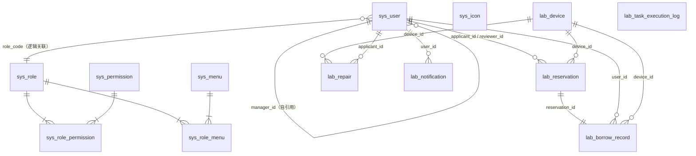

## Q1：SSM框架是什么，怎么在项目里体现的，为什么选择它？

**答：**

**SSM 是什么**

SSM 是 Spring、Spring MVC、MyBatis 三个框架的组合，是 Java Web 开发里比较经典的技术栈。三者分工明确：Spring 负责管理对象的创建和依赖关系，也就是 IoC 和 DI；Spring MVC 负责处理 HTTP 请求，把请求分发到对应的 Controller 方法；MyBatis 负责持久层，把 Java 方法和 SQL 语句对应起来操作数据库。

**在项目里怎么体现**

项目以 SSM 为基础，用 Spring Boot 做工程化简化。后端代码按三层组织：

- **Controller 层**：对外暴露 35 个以上的 RESTful 接口，接收前端 JSON 参数，返回统一格式的响应
- **Service 层**：处理核心业务逻辑，比如预约审批的状态流转、设备状态的联动更新，用 Spring 的声明式事务保证多表操作要么全部成功要么全部回滚
- **Mapper 层**：通过 MyBatis 的 XML 映射文件操作 MySQL，预约时间冲突检测等复杂查询用动态 SQL 处理

**为什么选择它**

主要有三个原因：第一，SSM 是目前高校管理信息系统里比较主流的技术组合，资料完善，实际项目参考多；第二，MyBatis 对 SQL 完全可控，对于预约冲突检测这类复杂查询，可以精确控制查询逻辑；第三，Spring Boot 大幅简化了传统 SSM 的 XML 配置，可以把精力更多放在业务实现上。

---

## Q2：整体架构是怎么搭建运行的？

**答：**

按照一个请求从浏览器出发到数据库返回的完整链路来讲：

**第一层：浏览器 — Vue 3 SPA**

Vue Router 的全局守卫 `router.beforeEach` 拦截每次路由跳转，读取路由配置里的 `meta.roles` 字段判断当前角色是否有权访问。菜单由 `useMenuStore` 动态渲染，不同角色登录后看到的功能入口本来就不一样。用户操作后，axios 把请求发出去，请求头里携带登录时返回的令牌。Vite 开发服务器把 `/api` 路径统一转发到 `localhost:8081`，前后端开发期间不需要额外处理跨域。

**第二层：Spring Security 过滤链**

请求到达后端，首先经过自定义的 `OncePerRequestFilter`：解析请求头里的令牌、还原用户身份，然后把身份信息写入 `SecurityContextHolder`，本次请求全局都能拿到当前用户是谁。令牌采用无状态设计，服务端不维护 Session。过滤链做接口级 RBAC 拦截，业务层再做数据可见范围校验，两层配合覆盖越权访问的各种情形。

**第三层：Controller → Service → Mapper**

Controller 层绑定参数、做入参校验、统一处理异常，不写业务逻辑，直接委托给 Service 层。Service 是核心，以审批通过为例：要更新预约状态、创建借用记录、修改设备状态、推送通知，多表联动通过声明式事务保证原子性。Mapper 层用 MyBatis XML 映射文件操作数据库，动态 SQL 处理条件灵活的查询。

**第四层：MySQL 8 + Redis**

数据库设计了 9 张表，覆盖六个业务域。外键保证引用完整性，高频查询字段建了索引避免全表扫描。Redis 默认关闭，令牌走内存存储；开启后切换到 `RedisTokenStore` 支持多节点部署，统计接口概览数据也会走缓存。

**总结：** 整个系统的核心思路是职责分层、安全前置、状态联动——各层边界清晰，互不越权。

---

## Q3：Redis 怎么发挥作用的？

**答：**

Redis 在系统里目前扮演的角色比较有限，默认是关闭的，通过环境变量 `APP_REDIS_ENABLED=false` 控制，系统在标准部署下完全不依赖 Redis。

**开启后具体做两件事：**

**第一件：令牌存储**

默认令牌存在内存里（`InMemoryTokenStore`），单节点没有问题，但多节点部署时节点间令牌无法共享会导致认证失败。开启 Redis 后切换到 `RedisTokenStore`，令牌统一存在 Redis 里，所有节点共享，支持水平扩展。

**第二件：统计接口缓存**

统计分析的概览接口需要聚合多张表的数据，开启 Redis 后结果会被缓存，避免每次请求重新做全表聚合，降低数据库压力。

目前 Redis 的使用深度较浅，缓存策略也比较简单。如果后续数据规模增大，更完善的做法是结合分页查询和更细粒度的缓存失效策略一起优化。

---

## Q4：项目实际部署了吗？如果没有，为什么？

**答：**

没有部署到生产环境，主要在本地完成了验收测试。

整个系统运行在本地环境：后端 `localhost:8081`，前端 `localhost:5173`。在 2026 年 3 月底做了一次完整的验收测试，核心的预约、审批、取用、归还流程全部跑通，四个角色账号的权限边界也逐一验证过。

没有正式部署主要是两个原因：一是论文阶段没有公网服务器资源；二是系统本身的定位就是校内局域网部署，本地验收基本能反映实际使用场景。

如果后续有条件落地，主要需要补充 HTTPS 配置和一次并发场景下的压测，现有架构上做这些扩展难度不大。

---

## Q5：设备管理是状态机驱动，怎么实现的？

**答：**

**状态定义**

设备共有六个状态：**可用、已预约、借出中、损坏、维修中、停用**。前五个由业务操作驱动，停用由管理员手动操作。

**流转路径**

```
可用
 │── 审批通过 ──────────→ 已预约
 │                         └── 确认取用 ──→ 借出中
 │                                           │── 正常归还 ──→ 可用
 │                                           └── 损坏归还 ──→ 损坏
 │                                                              └── 提交维修 ──→ 维修中
 │                                                                               └── 维修完成 ──→ 可用
 └── 预约超时失效 ──────→ 可用（释放回来）
```

**实现方式**

没有引入专门的状态机框架，而是在 Service 层用事务保证状态流转的原子性。每一个状态变更都是多表联动放在同一个事务里。以审批通过为例，Service 层同时做三件事：把预约记录状态改为"已通过"、新建一条借用记录、把设备状态改为"已预约"——三步用声明式事务包裹，任何一步失败全部回滚。

损坏归还是另一个典型联动：管理员归还时选择"损坏"，Service 层自动把设备状态改为 `DAMAGED`，同时创建一条维修申请记录，管理员不需要再去维修模块单独操作。

**定时任务兜底**

有两类状态变更靠定时任务自动处理：

- 预约审批通过后超过 24 小时未取用，自动标记失效，设备状态释放回"可用"
- 借用超过预计归还时间未归还，自动标记"逾期"并推送提醒

**核心原则**

设备状态字段从不允许人工直接修改，它是业务操作的结果，不是输入。这样师生查询时看到的状态永远是实时准确的，不会出现"显示可用但实际已被借走"的情况。

---

## Q6：你的意思就是状态维护是通过事务设计维护的？

**答：**

事务是**保障手段**，不是状态机本身，两者是不同层面的东西。

**状态机逻辑**在 Service 层，它决定的是"审批通过后应该把哪些字段改成什么值"——这是业务规则，写在代码里，规定了哪些状态流转是合法的，哪些是不允许的。比如"借出中"的设备不能直接跳到"维修中"，必须先归还、标记损坏，再走维修申请，这个约束是 Service 层的判断逻辑。

**事务**解决的是另一个问题：状态流转往往涉及多张表同时更新，事务保证这些更新要么全部成功、要么全部回滚，不会出现"设备状态改了但借用记录没写进去"这种中间状态。

准确的说法是：**Service 层定义状态流转规则，事务保证流转过程的数据一致性**，两者配合才构成完整的状态维护机制。

---

## Q7：你是在 Service 单独写了状态机逻辑用来约束状态流转对吗？给我举几个例子

**答：**

严格来说，没有写一个独立的状态机类，状态约束逻辑是分散在各个 Service 方法里的——每次操作前先检查当前状态是否合法，不合法就抛 409，合法才继续执行并更新状态。举三个真实的代码例子：

**例一：教师审批预约（ReservationService）**

```java
if (reviewer.getRoleCode() == RoleCode.TEACHER) {
    if (reservation.getStatus() != ReservationStatus.PENDING) {
        throw new ApiException(409, "当前预约状态不可由教师审核通过");
    }
    // 通过 → 改为 APPROVED
}
if (reservation.getStatus() != ReservationStatus.APPROVED) {
    throw new ApiException(409, "请先由教师审核通过");
}
// 管理员终审通过 → 设备改为 RESERVED，生成借用记录
device.setStatus(DeviceStatus.RESERVED);
```

教师只能审 `PENDING` 状态，管理员只能审 `APPROVED` 状态，顺序不对直接报错。

**例二：确认取用（BorrowRecordService）**

```java
if (record.getStatus() != BorrowStatus.PICKUP_PENDING) {
    throw new ApiException(409, "当前借用记录状态不可领取");
}
// 通过检查 → 设备改为 BORROWED
device.setStatus(DeviceStatus.BORROWED);
```

借用记录必须是"待取用"才能确认领取，其他状态一律拒绝。

**例三：归还设备（BorrowRecordService）**

```java
if (record.getStatus() != BorrowStatus.BORROWING
        && record.getStatus() != BorrowStatus.OVERDUE) {
    throw new ApiException(409, "当前借用记录状态不可归还");
}
// 根据归还时填写的设备状况决定设备下一个状态
device.setStatus("NORMAL".equals(actualCondition)
        ? DeviceStatus.AVAILABLE : DeviceStatus.DAMAGED);
```

只有"借用中"或"逾期"才能归还，归还时根据设备状况自动分叉——完好回到 `AVAILABLE`，损坏进入 `DAMAGED`。

**总结：** 约束逻辑是通过每个 Service 方法开头的状态前置检查实现的，不是一个集中的状态机类。这样做够用，但如果状态和流转规则再复杂一些，抽出一个专门的状态机会更好维护。

---

## Q8：预约时间冲突检测是怎么实现的？为什么是自适应一级两级审批？

**答：**

**时间冲突检测**

冲突判断的核心逻辑在 `ReservationService.ensureNoTimeConflict` 方法里：

```java
boolean conflict = reservationMapper.selectAll().stream()
    .filter(/* 排除当前记录本身 */)
    .filter(item -> Objects.equals(item.getDeviceId(), deviceId))
    .filter(item -> item.getStatus() != REJECTED
                 && item.getStatus() != CANCELLED
                 && item.getStatus() != EXPIRED
                 && item.getStatus() != RETURNED)
    .anyMatch(item ->
        startTime.isBefore(item.getEndTime())
        && endTime.isAfter(item.getStartTime()));

if (conflict) throw new ApiException(409, "同一时间段内设备已存在预约");
```

区间重叠的判断条件是：新预约的开始时间早于已有预约的结束时间，且新预约的结束时间晚于已有预约的开始时间，两个条件同时成立说明时间段重叠。过滤掉已拒绝、已取消、已失效、已归还的记录，只对"活跃中"的预约做冲突判断。

检测有两个触发点：**提交时检测一次，管理员终审时再检测一次**，防止两条申请同时提交、都通过初审后在终审环节打架。

目前用的是 `selectAll()` 全量加载再内存过滤，数据量大时性能会下降，是已知的不足，更好的做法是把冲突判断下推到 SQL 里用时间区间查询直接过滤。

**自适应一级两级审批**

代码里根据申请人角色在创建预约时直接设定初始状态：

```java
reservation.setStatus(
    applicant.getRoleCode() == RoleCode.TEACHER
        ? ReservationStatus.APPROVED   // 教师：直接跳过初审
        : ReservationStatus.PENDING    // 学生：等待教师初审
);
```

教师申请初始状态直接置为 `APPROVED`，通知发给管理员；学生申请初始状态是 `PENDING`，通知发给该学生绑定的教师（通过 `managerId` 字段关联）。

这样设计的原因是：教师对自己的教学行为本身负责，不需要再由另一个教师来审核；而学生借用设备涉及教学安排和责任归属，由指导教师先把一道关是合理的。两级审批如果对所有角色一视同仁，反而会给教师增加一个没有意义的等待环节。本质上是把"谁来负责这次借用"的现实逻辑映射到审批路径上。

---

## Q9：声明式事务是什么？审批通过同步更新三表的原子性是怎么保证的？

**答：**

**声明式事务是什么**

Spring 的声明式事务是指在方法上加 `@Transactional` 注解，Spring 会自动在方法执行前开启数据库事务，方法正常返回时提交，抛出异常时回滚。不需要手写 `begin / commit / rollback`，事务管理由框架接管，所以叫"声明式"。

**原子性是什么**

原子性是数据库事务 ACID 特性之一，含义是：一组操作要么全部成功提交，要么全部回滚，不存在只执行一半的中间状态。

审批通过时，更新预约状态、创建借用记录、更新设备状态三个写操作通过声明式事务包裹在一起，任何一步出错都会整体回滚，保证数据一致性。

---

## Q10：定时任务怎么实现的？超24h未取用自动失效 · 逾期自动标记推送 · 损坏归还自动触发维修申请

**答：**

前两个走定时任务，在 `SystemTaskScheduler` 里用 `@Scheduled` 注解驱动：

```java
@Scheduled(cron = "0 0/30 * * * ?")  // 每30分钟
public void expireReservationsTask() { ... }

@Scheduled(cron = "0 0/30 * * * ?")  // 每30分钟
public void overdueBorrowRecordsTask() { ... }
```

**超时失效**（`expirePickupPendingReservations`）：扫描所有 `PICKUP_PENDING` 状态的预约，判断结束时间是否已过当前时间，是的话把预约标记 `EXPIRED`、借用记录标记 `OVERDUE`、设备状态释放回 `AVAILABLE`，同时推送通知给申请人。

**逾期标记**（`markOverdueBorrowRecords`）：扫描所有 `BORROWING` 状态的记录，判断预计归还时间是否已过，是的话把记录改为 `OVERDUE`，推送通知给借用人，同时通知管理员和该学生的指导教师。

通知推送用幂等机制——`createSystemNotificationIfAbsent` 推送前先检查该用户对该业务对象是否已有同类未读通知，有就不重复推，防止每次定时任务跑都发一条消息。

**损坏归还自动触发维修**不是定时任务，是在 `BorrowRecordService.returnDevice()` 里同步完成的：管理员归还登记时填写设备状况，如果选择"损坏"，系统在同一次操作里把设备状态置为 `DAMAGED` 并自动创建维修申请记录，管理员不需要再去维修模块单独操作一遍。

---

## Q11：讲一下你论文的 ER 图

**答（第一次，有误，已更正见 Q12）：**

系统共 13 张表，按 6 个业务域说明 ER 结构。（此回答表述有误，中间表和辅助表不应计入业务表统计）

---

## Q12：重新讲一下你论文的 ER 图（论文只写了 9 张表）

**答：**

论文里是 9 张业务实体表，中间表和辅助表未单独列入统计，按 6 个业务域如下：

**用户域：** `sys_user`——存用户基本信息、角色、信用分，`manager_id` 自引用表达学生与指导教师的归属关系。

**角色权限域：** `sys_role`、`sys_permission`、`sys_menu`——角色和权限多对多关联，角色和菜单多对多关联，中间表 `sys_role_permission`、`sys_role_menu` 是关系表，不算独立业务实体。

**设备域：** `lab_device`——独立实体，设备状态字段由业务操作驱动，被预约、借用、维修三张表外键引用。

**预约域：** `lab_reservation`——`applicant_id` 和 `reviewer_id` 都指向 `sys_user`，`device_id` 指向 `lab_device`。

**借用归还域：** `lab_borrow_record`——通过 `reservation_id` 一对一关联预约记录，冗余了 `user_id` 和 `device_id`。

**维修与通知域：** `lab_repair` 由 `device_id` 关联设备、`applicant_id` 关联用户；`lab_notification` 通过 `user_id` 关联用户，用 `related_biz_type` + `related_biz_id` 做多态关联。

**核心链路：** `sys_user` → `lab_reservation` → `lab_borrow_record` → `lab_repair`，每步触发 `lab_notification`。

---

## Q13：你的论文有 ER 图，用你的 ER 图讲解你怎么设计表的

**答：**

**`sys_user`**：没有用外键关联 `sys_role`，直接在表里存 `role_code` 字符串，鉴权时不需要 join 角色表。`manager_id` 自引用表达学生与指导教师的归属关系，一张表解决层级关系，不需要额外关联表。

**角色权限域（`sys_role`、`sys_permission`、`sys_menu`）**：标准 RBAC 设计，角色和权限、角色和菜单均为多对多，各建中间表。菜单和权限分开设计——菜单控制前端导航显示，权限控制后端接口访问，粒度不同，分开更灵活。

**`lab_device`**：`status` 字段用枚举字符串值而非外键约束，状态只能由业务操作写入，Service 层保证合法性，不依赖数据库约束。

**`lab_reservation`**：两个外键都指向 `sys_user`（`applicant_id` 申请人、`reviewer_id` 最终审批人），教师初审和管理员终审不拆成两条记录，用 `status` 字段表达流转，一张表即可看到完整状态，减少查询复杂度。

**`lab_borrow_record`**：与预约表一对一，但冗余了 `user_id` 和 `device_id`。借用记录是查询最频繁的表，冗余字段避免每次 join 预约表，以空间换查询效率。

**`lab_repair`**：`applicant_id` 记录的是导致维修的借用申请人，不是发起操作的管理员，便于追责溯源。损坏归还时系统自动填入。

**`lab_notification`**：用 `related_biz_type` + `related_biz_id` 做多态关联，一张表覆盖所有业务类型的通知，不随业务扩展增加表。代价是无法建外键约束，由业务层保证引用完整性。

**设计核心取舍：** 高频查询路径优先减少 join；状态由业务层保证，不依赖数据库约束；通知用多态关联保持扩展性。

---

## Q14：你讲讲你怎么开始设计表的，从头到尾给我你的设计思路

**答：**

**第一步：从业务流程抽实体**

先梳理核心流程：学生预约 → 审批 → 取用 → 归还，出了损坏就维修。把这条链路里涉及的"东西"列出来——用户、设备、预约、借用记录、维修单，每个实体对应一张表。通知横切所有流程，单独一张表。

**第二步：定角色和权限体系**

四个角色能看什么、能操作什么不一样，决定了必须有角色表和权限表。菜单控前端导航，权限控后端接口，粒度不同所以分开建表，用中间表和角色关联。

**第三步：确定实体间关系，决定怎么关联**

两个典型决策点：

- `sys_user` 和 `sys_role` 本是多对一，正常用外键，但鉴权是每次请求都要做的高频操作，join 代价大，所以直接在 `sys_user` 存 `role_code` 字符串，牺牲范式换效率。
- `lab_borrow_record` 理论上通过 `reservation_id` 已能关联到用户和设备，但借用列表查询最频繁，选择冗余 `user_id` 和 `device_id`，以空间换查询效率。

**第四步：设备状态维护策略**

设备状态只能是业务操作的结果，不允许直接 update。没有建状态流转表，也不靠数据库约束，而是把约束放在 Service 层——每次操作前检查当前状态是否合法再执行，所有流转逻辑集中在代码里，数据库只存最终结果。

**第五步：通知表的多态设计**

通知会跟预约、借用、维修多种业务挂钩，如果每种业务单独建通知表，后续扩展要不断加表。所以设计 `related_biz_type` + `related_biz_id` 做多态关联，一张表覆盖所有场景。

**第六步：补索引**

建完表后看高频查询条件：`account`、`login_id`、`device_code` 建唯一索引，外键字段依赖主键 join，不单独加索引。

**总结：** 先从业务流程抽实体 → 确定关系 → 在每个关联点做取舍（范式 vs 查询效率）→ 把约束放到合适的层（数据库 or 业务层）→ 最后补索引。

---

## Q15：讲完了表，接下来讲讲你后端搭建设计思路

**答：**

**第一步：确定整体架构**

前后端分离，后端只提供 RESTful 接口。选 Spring Boot 减少配置成本，三层结构（Controller / Service / Mapper）职责不越界。

**第二步：先把安全层搭起来**

安全是所有业务的前置条件，第一个搭的不是业务模块，而是 Spring Security 过滤链。无状态设计——服务端不存 Session，登录签发令牌，前端每次请求带在 Header 里。`OncePerRequestFilter` 解析令牌、还原用户身份写入 `SecurityContextHolder`，接口级 RBAC 配在 Security 配置类里，业务层再做数据可见范围的二次校验。

**第三步：定统一响应格式和全局异常处理**

业务开发前先把基础设施定好：统一封装 `ApiResponse<T>` 作为所有接口返回结构，`@RestControllerAdvice` 做全局异常处理，业务层直接抛 `ApiException` 带状态码，不在每个方法里写 try-catch。

**第四步：按业务域逐模块开发**

顺序和业务依赖一致：用户权限 → 设备 → 预约 → 借用归还 → 维修与通知。每个模块：建表 → 写 Mapper XML → 写 Service 逻辑 → 写 Controller 暴露接口。

**第五步：跨模块联动放 Service 层事务**

多表联动（如审批通过同时改预约状态、建借用记录、改设备状态）全部放在同一个 `@Transactional` 方法里，任何一步失败整体回滚。状态流转约束也在 Service 层执行，方法开头先校验状态是否合法，不合法直接抛 409。

**第六步：定时任务兜底**

超时失效和逾期标记用 `@Scheduled` 定时扫描处理，推送通知加幂等检查避免重复推送。

**第七步：接口文档和测试**

接口按业务域整理文档，四个角色账号分别跑主流程做验收，核心边界场景写测试用例覆盖。

**总结：** 安全层前置 → 统一基础设施 → 按业务依赖顺序分模块开发 → 跨模块联动走事务 → 定时任务兜底异步状态 → 测试验收。

---

## Q16：讲讲你的系统用例图

**答：**

系统有四个 Actor，按角色逐一说明用例。

**学生：** 提交预约申请（填时间段和用途）、查看预约状态、接收审批结果通知、查看借用记录、修改密码（首次登录强制）、查看个人信息。归还由管理员代为操作。

**教师：** 与学生共享查看设备、提交预约，但预约初始状态直接进管理员终审（extend 关系）。独有用例是**审批学生预约**——做初审通过或驳回，是学生没有的操作权限。

**管理员：** 用例最多。设备域：增删改查和批量导入。预约域：终审预约。借用域：确认取用、登记归还（归还时填写设备状况，选损坏触发自动维修申请）。维修域：处理维修申请、标记维修完成。用户域：管理教师和学生账号（创建、启禁用、重置密码）。统计分析：查看概览数据和各类排行榜。

**超级管理员：** 在管理员所有用例基础上，增加：管理管理员账号、配置角色权限、配置菜单。`visibleTo()` 方法保证跨级操作被拦截。

**用例间关系：**

- 所有业务用例 include "登录认证"（前置条件）
- "归还设备"选损坏 extend 出"自动创建维修申请"
- "审批通过" extend 出"推送通知给申请人"
- "定时扫描超时预约" extend 出"自动标记失效并推送通知"

**核心思路：** 学生发起、教师初审、管理员执行、超管配置，四个角色权限形成单向层级，没有交叉越权。

---

## Q17：讲一下你安全层设计搭建思路，尤其是接口级 RBAC 配在 Security 配置类里，业务层再做数据可见范围的二次校验

**答：**

安全层分两层：

**第一层：SecurityConfig + AuthTokenFilter — 认证**

`SecurityConfig` 只有三类路径放行（健康检查、登录、静态文件），其余全部 `.anyRequest().authenticated()`，只回答"你有没有登录"，不区分角色。

`AuthTokenFilter`（`OncePerRequestFilter`）每个请求执行一次：从 Header 取 Bearer Token，查库找用户，把用户对象和 `ROLE_xxx` 写入 `SecurityContextHolder`，后续所有层都能拿到当前请求是谁。还额外处理首次登录强制改密拦截。

**第二层：Service 层 — 数据可见范围校验**

Security 配置只能做路径级拦截，表达不了"教师只能看自己名下学生"这种数据归属规则，所以放到 Service 里。`UserService` 里两个关键私有方法：

- `requireRoles(RoleCode... allowedRoles)`：校验当前用户角色是否在允许列表，不在直接抛 403。
- `visibleTo(UserEntity currentUser, UserEntity target)`：数据可见范围——超管看不到其他超管、管理员只能管教师和学生、教师只能看 `manager_id` 指向自己的学生。

每个 Service 方法开头先调 `requireRoles()` 卡角色，再调 `visibleTo()` 卡数据归属，两道检查都过才执行业务逻辑。

**为什么不全放 Security 配置里：** Spring Security 路径匹配只能表达"URL 需要哪个角色"，无法表达跟数据库记录挂钩的归属规则。接口级用 Security 做粗粒度拦截，数据级放 Service 做细粒度校验，两层配合覆盖所有越权场景。

---

## Q18：在 md 文件给出 13 张表的 ER 图（只展示表间关系，不展示字段）



> `sys_icon` 和 `lab_task_execution_log` 无外键关联，是独立辅助表。

---

## Q19：你的表哪些是直接外键关联？哪些是跨模块关联，有什么区别？

**答：**

系统 DDL 里**没有任何一条 `FOREIGN KEY` 约束**，所有表间关联均为应用层逻辑关联。

**紧耦合引用——同域内、字段直接指向另一张表主键**

- `sys_role_permission`：`role_id` 指向 `sys_role`，`permission_id` 指向 `sys_permission`，两张表一起设计一起查，概念上是外键，只是没有加 `FOREIGN KEY` 声明
- `sys_role_menu`：同上
- `lab_borrow_record.reservation_id` → `lab_reservation`：借用记录是预约审批通过后生成的，一一对应，生命周期强绑定

**跨模块逻辑关联——跨业务域，靠业务层保证一致性**

- `lab_reservation.applicant_id / reviewer_id` → `sys_user`：预约模块引用用户模块，用户删了预约不级联，Service 层做空值保护
- `sys_user.role_code` → `sys_role`：不是 ID 引用而是字符串 code，完全逻辑关联
- `lab_notification.related_biz_id`：多态关联，靠 `related_biz_type` 在业务层解析，本身没法加外键

**为什么不加 `FOREIGN KEY` 约束：** 加了外键删数据要按引用顺序操作，维护成本高；多态关联本来就没法加外键。系统规模不大，选择把引用完整性交给 Service 层负责，是工程取舍而非设计缺陷。

**核心区别：** 紧耦合引用是"两张表本来就是一个整体的两面"；跨模块逻辑关联是"我需要知道这是谁的数据，但不依赖对方的生命周期"。

---

## Q20：你的 sys 的 4 张表都是什么关系

**答：**

sys 域 4 张主表：`sys_user`、`sys_role`、`sys_permission`、`sys_menu`。

**`sys_user` 和 `sys_role`：多对一**
一个用户对应一个角色，一个角色对应多个用户。`sys_user` 直接存 `role_code` 字符串，逻辑关联。`sys_user` 还有自引用关系，`manager_id` 指向同表另一条记录，表达学生归属哪个教师。

**`sys_role` 和 `sys_permission`：多对多**
一个角色拥有多个权限，一个权限可被多个角色共享。通过中间表 `sys_role_permission`（`role_id` + `permission_id` 联合主键）连接。

**`sys_role` 和 `sys_menu`：多对多**
结构与上面相同，通过 `sys_role_menu` 中间表连接。一个角色能看哪些菜单，一个菜单可被多个角色访问。

**`sys_permission` 和 `sys_menu`：无直接关联**
两者都挂在 `sys_role` 下，互相之间没有外键，是平行关系。权限控制后端接口访问，菜单控制前端导航显示，职责不同，独立管理。

**总结：** `sys_role` 是这 4 张表的核心枢纽，用户通过它拿到角色身份，角色通过它关联权限和菜单。

---

## Q21：继续讲所有 lab 表之间关系

**答：**

lab 域 6 张表：`lab_device`、`lab_reservation`、`lab_borrow_record`、`lab_repair`、`lab_notification`、`lab_task_execution_log`。

**`lab_device` 是核心被引用表**，自身不引用其他 lab 表，被 `lab_reservation`、`lab_borrow_record`、`lab_repair` 三张表通过 `device_id` 引用。

**`lab_reservation` → `lab_device`：多对一**，一台设备可在不同时间段被预约多次，一条预约只对应一台设备。

**`lab_reservation` → `lab_borrow_record`：一对一**，预约审批通过后生成一条借用记录，`lab_borrow_record.reservation_id` 指向 `lab_reservation`，没有预约就没有借用。

**`lab_borrow_record` → `lab_device`：多对一**，冗余了 `device_id`，虽通过 `reservation_id` 已能追溯到设备，但为避免频繁 join 直接在借用表里也存一份。

**`lab_repair` → `lab_device`：多对一**，一台设备可多次维修。`lab_borrow_record` 和 `lab_repair` 之间**无直接外键**，损坏归还时由 Service 层同步触发创建维修记录。

**`lab_notification` 与其他 lab 表：多态关联**，不直接外键引用任何一张 lab 表，用 `related_biz_type` + `related_biz_id` 做多态关联，由业务层按类型解析指向对应记录。

**`lab_task_execution_log`：完全独立**，只记录定时任务执行日志，不引用任何其他表。

**整条链路：** `lab_device` ← `lab_reservation` → `lab_borrow_record` →（触发）`lab_repair`，每个节点推送 `lab_notification`，`lab_task_execution_log` 旁路记录定时任务执行情况。

---

## Q22：你为什么选择做这个系统？它和同类系统有什么区别？

**答：**

选题有两个原因：一是身边真实存在这个痛点，实验室设备借用靠找人问、靠纸质记录，信息不透明；二是业务流程完整，预约、审批、借还、维修形成闭环，能覆盖前后端分离、权限设计、状态机、事务管理等核心知识点，适合作为综合性毕设题目。

与同类系统相比，差异主要两点：第一，审批路径自适应，学生走两级、教师直接进终审，不一刀切；第二，设备状态完全由业务操作驱动，损坏归还自动触发维修，逾期由定时任务自动标记，不依赖人工维护。大多数同类系统要么没有分级审批，要么设备状态靠管理员手动更新。

---

## Q23：你说你的论文亮点有 4 点，讲讲这四点怎么实现，为什么这么设计？

**答：**

**① 自适应审批路径**
实现：提交预约时根据申请人角色直接设定初始状态——学生设为 `PENDING` 等待教师初审，教师直接设为 `APPROVED` 进管理员终审。
为什么：教师对自己的教学行为负责，不需要另一个教师审核，强制两级是无意义的等待。把现实中"谁来负责这次借用"的逻辑直接映射到初始状态，一行代码解决，无需维护额外流程配置表。

**② 状态机驱动设备状态**
实现：设备 6 种状态全由 Service 层业务操作写入，每个方法开头做前置状态校验，不合法抛 409，多表联动放在同一 `@Transactional` 事务里。定时任务每 30 分钟扫描兜底超时失效和逾期标记。
为什么：若允许人工直接改状态，会出现"显示可用但已被借走"的脏数据。状态是业务操作的结果而不是输入，这个约定保证查询时看到的永远是准确的实时状态。

**③ 幂等通知推送**
实现：推送前调 `createSystemNotificationIfAbsent`，检查该用户对该业务对象是否已有同类型未读通知，有就跳过不推。
为什么：定时任务每 30 分钟跑一次，逾期记录每次都会被扫到，没有幂等检查就会每半小时推一条提醒，体验极差。幂等推送保证同一件事只通知一次，直到用户已读或状态变更。

**④ 双层权限校验**
实现：第一层 Spring Security 过滤链做认证，所有接口要求登录。第二层 Service 层 `requireRoles()` 卡角色、`visibleTo()` 卡数据归属——超管看不到其他超管、管理员只管教师和学生、教师只看自己名下学生。
为什么：Security 只能做路径级拦截，无法表达跟数据库记录挂钩的归属规则。两层配合才能同时覆盖接口越权和数据越权两种场景。

---

## Q24：你讲一下你的系统高并发怎么做的

**答：**

如实回答：系统没有专门做高并发设计，定位是校内局域网使用，并发量级约几十人同时在线，不是高并发场景。

**有基础保障的地方**

`@Transactional` 保证单次操作内多表联动的数据一致性，不会出现半提交问题。令牌无状态设计，服务端不维护 Session，多请求可并发处理，不因 Session 竞争阻塞。

**已知并发漏洞**

时间冲突检测是最明显的弱点：`selectAll()` 全量加载内存过滤，两个用户同一时刻提交同一设备同一时段的预约，两个请求可能同时通过冲突检测并各自写入，产生冲突数据。现有代码没有加分布式锁，也没有数据库唯一约束兜底，是已知缺陷。

**如果要做高并发改造**

将冲突检测下推到 SQL（时间区间条件查询替代全量加载）；终审写操作加乐观锁或数据库行锁；多节点部署时开启 Redis 做令牌共享存储，并用分布式锁保护冲突检测的读-写原子性。但在实验室规模下这些改造没有必要，属于后续可迭代方向。

---

## Q25：你不是有 Redis 吗，为什么没做高并发？

**答：**

有 Redis 但没用它做并发控制，两件事。

**Redis 实际做了什么：** 一是令牌存储，开启后从内存切换到 Redis，解决多节点令牌共享问题，不是并发问题；二是统计接口缓存，降低数据库聚合压力。

**为什么没用 Redis 做分布式锁：** 解决冲突检测竞态需要分布式锁（如 Redis `SETNX` 或 Redisson），锁住"同一台设备的预约写操作"保证检测和写入原子性。这部分确实没有实现——系统定位校内局域网单节点部署，并发量到不了需要分布式锁的级别，引入这个复杂度性价比不高，当时判断没做。

**如实承认：** 有 Redis 不等于做了高并发，这是表述不严谨的地方。冲突检测的竞态条件漏洞没有被覆盖，是系统已知不足。

---

## Q26：你讲讲你准备怎么用 Redis 做高并发

**答：**

针对系统实际并发风险，Redis 主要用在三个地方：

**① 分布式锁解决冲突检测竞态（最核心）**

用 Redisson 对设备 ID 加分布式锁，提交预约和终审时先 `lock(deviceId)`，锁住后再做冲突检测、再写入，写完释放锁。锁粒度是设备级别，同一台设备的预约操作串行化，不同设备互不影响。

```java
RLock lock = redissonClient.getLock("reservation:device:" + deviceId);
lock.lock();
try {
    ensureNoTimeConflict(deviceId, startTime, endTime, null);
    // 写入预约记录
} finally {
    lock.unlock();
}
```

**② 热点数据缓存减少数据库压力**

设备列表和详情读多写少，缓存到 Redis，设备状态变更时主动失效对应缓存。统计概览接口已有缓存骨架，补全失效策略即可。

**③ 令牌存储支持多节点**

已有开关，`APP_REDIS_ENABLED=true` 切换到 `RedisTokenStore`，多节点部署令牌共享，水平扩展不需要改代码。

**改造优先级：** 分布式锁 > 设备缓存 > 令牌存储。前者解决数据正确性问题，后两者解决性能问题。

---

## Q27：令牌存储支持多节点讲讲

**答：**

**问题：** 默认 `InMemoryTokenStore` 把令牌存在 JVM 内存的 `ConcurrentHashMap` 里。单节点没问题，但多节点负载均衡时，用户登录打到节点 A，令牌写进 A 的内存；下次请求打到节点 B，B 内存里没有这个令牌，认证失败，用户莫名掉登录。

**Redis 怎么解决：** `RedisTokenStore` 把存储换成 Redis：

```java
// 创建令牌：写进 Redis，带 TTL
redisTemplate.opsForValue().set("auth:token:" + token, userId, tokenTtl);
// 验证令牌：从 Redis 查
String value = redisTemplate.opsForValue().get("auth:token:" + token);
```

Redis 是所有节点共享的外部存储，令牌在哪个节点创建、在哪个节点验证都能查到，节点间不再有状态差异。

**切换方式：** 两个实现共用同一个 `TokenStore` 接口，`APP_REDIS_ENABLED=true` 注入 `RedisTokenStore`，`false` 注入 `InMemoryTokenStore`，业务代码不需要改动。

**本质：** 这不是高并发优化，而是把节点本地状态外移到共享存储，让每个节点可以无差别处理任意请求，是水平扩展的前提条件。

---

## Q28：你的测试都测试了哪些内容

**答：**

后端是完整集成测试，用真实测试数据库，每个用例前重置数据，用 MockMvc 走完整 HTTP 链路。前端用 Vitest 做单元测试。

**后端测试覆盖：**

- **认证安全**：登录/改密流程、首次登录强制改密拦截、未带令牌返回 401、重置密码触发首次登录标记
- **用户管理**：层级建账号链路（超管→管理员→教师→学生）、教师只能看自己学生、禁用用户后无法登录
- **角色权限**：超管增删改角色并配权限菜单、管理员访问返回 403
- **设备管理**：管理员增删改禁用设备、学生创建设备返回 403、表单上传导入设备
- **预约管理**：提交/审批流程、冲突时间段返回 409、教师拒绝不填理由返回 400、学生查不到他人预约、自适应审批（教师申请直接 `APPROVED`）、超时失效释放设备
- **借用归还**：取用后设备变 `BORROWED`、正常归还变 `AVAILABLE`、逾期标记和提醒查询
- **维修管理**：提交后设备变 `REPAIRING`、维修完成变 `AVAILABLE`、不可修复保持 `DAMAGED`、重复提交活跃维修返回 409
- **定时任务**：模拟时间点触发，验证失效数、逾期数、推送数符合预期
- **统计分析**：概览数据、热门/损坏/违规三类排行、月度/半年/全部时间维度
- **消息通知**：未读数、分类摘要、确认消息、权限拦截、任务执行日志

**前端测试覆盖：** 路由权限守卫（不同角色可访问菜单项）、视图组件渲染、auth Store 状态管理、API 集成。

---

## Q29：不够详细，你怎么设计测试链路，用了哪些工具，怎么得到测试结果的？

**答：**

**测试设计思路**

后端选集成测试而非单元测试：系统核心在多表联动和状态流转，mock 掉数据库测不到真实事务回滚和 SQL 语义。每条用例是完整业务链路——HTTP 请求经 Spring Security 过滤链、Controller、Service、Mapper，写库再读库验证，不绕过任何一层。

**工具**

后端：

- `@SpringBootTest`：启动完整 Spring 上下文
- `@AutoConfigureMockMvc`：注入 `MockMvc` 模拟 HTTP 请求，不需要真实端口
- `@DirtiesContext(AFTER_EACH_TEST_METHOD)`：每个测试后销毁重建上下文，测试间隔离
- `@BeforeEach` 调 `resetDatabase()`：每次测试前清库重灌种子数据，起点一致
- 独立测试库 `lab_booking_test`：不污染开发库
- JaCoCo：生成覆盖率报告

前端：Vitest + Vue Test Utils

**测试链路结构**

每个用例：登录拿令牌 → 发业务请求并断言响应字段 → 再发查询请求验证数据库状态落地。以预约流程为例：

```
loginAndGetToken(学生) → POST /reservations（断言 status=PENDING）
→ loginAndGetToken(教师) → PUT /approve（断言 status=APPROVED）
→ loginAndGetToken(管理员) → PUT /approve（断言 status=PICKUP_PENDING）
→ GET /devices/{id}（断言 device.status=RESERVED）
```

每步不只断言当前返回，还验证联动数据是否正确落地。

**怎么得到测试结果**

```bash
# 后端
cd admin-server && mvn clean test
# 覆盖率报告：target/site/jacoco/index.html

# 前端
cd admin-ui && npm run test:coverage
# 覆盖率报告：coverage/ 目录
```

控制台输出每个用例通过/失败，失败时打印断言差异；JaCoCo 报告可以看每个类和方法的行覆盖率与分支覆盖率。

---

## Q30：请你重新回答你的测试思路

**答：**

**第一步：确定测试策略**

系统核心在多表联动和状态流转，不是孤立函数。单元测试 mock 掉数据库，测不到事务是否真的回滚、SQL 写没写对、跨表状态联动有没有漏。所以选集成测试，每个用例打到真实数据库，验证从请求到落库的完整链路。

**第二步：搭测试环境**

建独立测试库 `lab_booking_test` 和开发库隔离。`@SpringBootTest` 启动完整 Spring 上下文，`@AutoConfigureMockMvc` 注入 `MockMvc` 模拟 HTTP 请求。`@DirtiesContext` 每个测试方法后销毁重建上下文，`@BeforeEach` 调 `resetDatabase()` 清库重灌种子数据，每个用例从干净一致的起点开始，互不干扰。

**第三步：按业务链路设计用例**

不按接口逐个测，按完整业务流程设计用例。链路内每一步都断言：不只断言当前请求返回值，还额外发查询请求验证联动数据是否落库。比如管理员终审通过，断言预约状态变 `PICKUP_PENDING` 后，再查设备，断言设备状态已变 `RESERVED`，确认跨表联动真的生效。

**第四步：覆盖边界场景**

主流程跑通后，单独写边界用例：冲突时间段返回 409、教师拒绝不填理由返回 400、学生查不到他人预约、越权操作返回 403、重复提交活跃维修被拦截等。专门验证约束逻辑。

**第五步：验证定时任务**

定时任务不能等，用 `systemTaskService.runAllTasks(指定时间点)` 手动传模拟时间触发，执行完查库验证失效数量、逾期标记数量、推送数量是否符合预期。

**运行与结果**

`mvn clean test` 跑全部用例，失败时打断言差异定位问题。JaCoCo 生成覆盖率 HTML 报告在 `target/site/jacoco/index.html`，可看行覆盖率和分支覆盖率。前端 `npm run test:coverage` 同理。

---

## Q31：你的 SQL 表之间没有写严格的外键，那么怎么联动其他表的？可以举个例子吗？

**答：**

没有外键，联动靠 Service 层显式写多张表。

**例子：管理员终审通过预约（`approveReservationInternal`）**

```java
// 第一步：改预约状态
reservation.setStatus(ReservationStatus.PICKUP_PENDING);
reservationMapper.upsertReservation(reservation);

// 第二步：改设备状态
device.setStatus(DeviceStatus.RESERVED);
deviceMapper.upsertDevice(device);

// 第三步：创建借用记录
createBorrowRecord(reservation); // → borrowRecordMapper.upsertBorrowRecord(record)
```

三条独立的 UPDATE/INSERT 顺序执行，没有级联，没有触发器。Service 层"知道"审批通过需要同时更新预约、设备、借用记录三张表，这个知识写在代码里，不在数据库里。

**如实承认的问题**

查代码发现，方法上没有加 `@Transactional`，意味着第二步写成功、第三步写失败时数据库会停在中间状态——设备状态已改但借用记录没创建。这是真实的缺陷，生产系统应该用事务包裹保证原子性。论文里表述了"声明式事务"，但代码里并没有实际加注解，是实现上的不足。

---

## Q32：讲一下你说的第六步补索引——建完表后看高频查询条件，account、login_id、device_code 建唯一索引，外键字段依赖主键 join，不单独加索引

**答：**

实际建了 5 个唯一索引：

```sql
CREATE UNIQUE INDEX uk_sys_user_account    ON sys_user(account);
CREATE UNIQUE INDEX uk_sys_user_login_id   ON sys_user(login_id);
CREATE UNIQUE INDEX uk_sys_role_code       ON sys_role(role_code);
CREATE UNIQUE INDEX uk_sys_permission_code ON sys_permission(permission_code);
CREATE UNIQUE INDEX uk_lab_device_code     ON lab_device(device_code);
```

**为什么是这几个字段**

`account` 和 `login_id` 是登录入口，每次认证都要按这两个字段查用户，是最高频的查询路径。同时业务上要求唯一，唯一索引一举两得：加快查询 + 数据库层面兜底唯一性约束。`role_code`、`permission_code`、`device_code` 同理——按 code 查是最自然的查询方式，且业务要求唯一。

**为什么外键字段不单独加索引**

系统主要查询模式是"先查主表拿到 ID，再按主键 join 从表"，主键自带索引，不需要额外加。数据量级在几百条设备、几千条预约，全表扫描代价可接受，过度加索引反而增加写入时维护索引的开销。数据量增大到万级以上，`device_id`、`applicant_id` 这类高频过滤字段才值得补。

---

## Q33：`related_biz_type + related_biz_id` 字段关联触发通知的业务对象是什么意思？

**答：**

用一条真实通知记录来讲。学生提交预约时，系统给教师推通知：

```java
createSystemNotificationIfAbsent(
    teacherId, type, "新预约待审核", "...",
    "RESERVATION",                   // related_biz_type
    reservation.getReservationId()   // related_biz_id，如 1001
);
```

数据库里这条记录：`related_biz_type = "RESERVATION"`，`related_biz_id = 1001`。前端拿到后知道跳到预约详情页查第 1001 号预约。

**为什么不直接建 `reservation_id` 外键字段**

通知可以关联多种业务：审批通知关联预约、逾期通知关联借用记录、维修完成通知关联维修单。各建外键，表里就要有三列，大多数时候两列是 null，后续新增业务类型还要加列。

用 `related_biz_type + related_biz_id` 这一对字段覆盖所有类型——`related_biz_type` 告诉你去哪张表找，`related_biz_id` 告诉你找哪条记录，这就是多态关联：同一字段根据类型指向不同的表。

**代价：** 不能建外键约束，引用完整性靠业务层保证；对应业务记录被删后 `related_biz_id` 成悬空指针，查询时需做空值保护。

---

## Q34：你在测试过程中担任了什么角色？

**答：**

测试全程一个人完成，同时兼了需求方、开发和测试三个角色。

**后端集成测试：** 自己设计用例、自己写代码。对照业务流程列出完整链路和边界场景，用 MockMvc 串起来，每步断言响应值并验证联动数据落库。跑 `mvn clean test`，失败的定位修复，直到全部通过。

**手工验收测试：** 测试代码覆盖不到的前端交互、文件上传、页面跳转，用四个角色账号分别登录手动操作，逐步确认菜单、权限边界、状态显示是否正确。2026 年 3 月底做了一次完整验收，核心流程从头跑到尾。

**不足：** 自己测自己的代码，容易对设计假设产生盲点，测试方向会不自觉偏向"能走通的路径"，边界破坏性测试覆盖可能不够全面。独立测试人员介入会更严格。

---

## Q35：你的测试工作量体现在哪里？

**答：**

**代码量：** 后端测试文件近 1900 行，是项目中单个文件最长的。前端 19 个 `.spec.ts` 文件覆盖所有视图组件、路由守卫和 Store。

**用例数量与密度：** 后端 37 个测试方法，每个方法是完整链路——单个用例平均发 4～8 个 HTTP 请求，每个请求都有 `jsonPath` 断言。统计分析用例要先走完预约、取用、逾期、损坏归还、提交维修整套前置流程，再验证四个统计接口，单个用例将近 20 个请求。

**覆盖宽度：** 37 个用例覆盖全部模块（认证、用户、角色权限、设备、预约、借用归还、维修、定时任务、统计、消息通知），四个角色都有参与，正向流程和拒绝场景均覆盖。

**测试基础设施：** 专门写了 `loginAndGetToken`、`createAndApproveReservation`、`pickupApprovedReservation` 等辅助方法，让链路类测试能复用前置步骤，避免重复代码。

**手工验收：** 四个角色账号逐一登录，手动跑完核心流程，验收前端界面、权限路由、状态展示，形成验收报告。

测试代码工作量不亚于业务功能开发，是和业务代码同等认真写的，不是事后补充的形式。

---

## Q36：你讲讲你设计测试的思路，总结一下你扮演的角色与工作量

**答：**

**测试设计思路**

先确定策略：系统价值在多表联动和状态流转，单元测试 mock 掉数据库验证不了这些，所以选集成测试，每个用例打真实数据库走完整链路。

搭环境：独立测试库防止污染开发数据，每个用例前 `resetDatabase()` 保证起点一致，`@DirtiesContext` 保证上下文隔离。

用例设计分两层：第一层按业务链路——一条完整流程一个用例，每步断言当前返回值，再额外查询验证联动数据落库；第二层补边界场景——冲突检测、越权拦截、状态非法操作。定时任务用 `runAllTasks(模拟时间)` 手动触发，传入指定时间点绕过等待。

**角色**

全程一个人，同时担任需求分析者（知道测什么）、测试设计者（决定怎么测）、测试开发者（写代码）、测试执行者（跑用例、定位失败、修复再跑）。没有独立测试人员，自己测自己的代码，是最大的局限。

**工作量**

后端 37 个测试方法、近 1900 行测试代码，单个用例平均 4～8 个请求加断言，密集用例将近 20 个请求；前端 19 个 spec 文件；专门写了三个辅助方法复用前置步骤；最后四个角色账号手工跑完整验收，形成验收报告。

**一句话总结：** 测试是我独立完成的第二套完整工程，工作量和业务开发相当，但因缺乏独立视角，覆盖的盲点也由我自己承担。

---

## Q37：什么是集成测试？你说你的测试分为后端集成测试、前端单元测试、功能验收测试、性能安全测试，为什么？有什么区别？

**答：**

先纠正：性能测试和安全测试在这个项目里没有系统性地做，实际只做了三类：后端集成测试、前端单元测试、手工功能验收测试。

**什么是集成测试**

把多个组件组合在一起验证协同是否正确。区别于单元测试只测一个函数，集成测试测的是"请求经过 Security 过滤 → Controller → Service → Mapper → 数据库，整条链路走下来结果对不对"。

**三类测试的区别和分工**

|              | 测什么                                   | 为什么这样测                       | 局限                            |
| ------------ | ---------------------------------------- | ---------------------------------- | ------------------------------- |
| 后端集成测试 | 多表联动、状态流转、权限拦截、事务正确性 | 必须打真实数据库，内存里模拟不出来 | 启动上下文 + 重置数据库，运行慢 |
| 前端单元测试 | 路由守卫、Store 逻辑、组件渲染           | 纯前端判断逻辑，不依赖后端，速度快 | 测不到真实 HTTP 联调和页面交互  |
| 手工功能验收 | 界面展示、菜单权限、文件上传、页面跳转   | 测试代码覆盖不到用户视角的体验     | 依赖人工，难以重复、易遗漏      |

**为什么没做性能和安全测试**

性能测试需要并发压测工具（如 JMeter），实验室规模下意义不大；安全测试需要专门渗透测试手段，超出毕设范围。这是系统的不足，正式上线前应补充这两项。

---

## Q38：你知道什么是黑白盒测试吗？你做了吗？

**答：**

**黑盒测试：** 不关心内部实现，只看输入和输出，把系统当不透明的盒子，验证结果是否符合预期，不依赖代码结构。

**白盒测试：** 了解内部实现，针对具体代码路径、分支、条件设计用例，知道代码里有哪些判断，专门针对每个分支写验证。

**我做了哪种**

实际是介于两者之间、**更偏白盒**。

后端集成测试本质是白盒：我是自己写的业务代码，测试用例对照代码逻辑设计——知道审批通过改三张表所以写三个断言，知道状态前置校验会拒绝非法状态所以专门写 409 边界用例，知道教师申请初始状态是 `APPROVED` 所以专门验证该分支。测试路径的选择来自对代码内部的了解，是白盒思维。

手工功能验收测试更偏黑盒：用角色账号操作界面，只看功能结果对不对，不关心后端实现，接近用户视角。

**不足：** 纯黑盒应由不了解代码实现的人来做，才能发现设计假设以外的问题。自己测自己天然带白盒视角，容易只测"已知会走的路径"，对意料外输入覆盖不足。

---

## Q39：简单总结一下你的测试

**答：**

三类测试：

**后端集成测试**——打真实数据库，MockMvc 走完整 HTTP 链路，37 个用例、近 1900 行，覆盖全部模块的主流程和边界场景。

**前端单元测试**——Vitest，19 个 spec 文件，测路由守卫、Store 逻辑、组件渲染。

**手工功能验收**——四个角色账号分别登录，手动跑完核心流程，验收界面和权限边界。

---

## Q43：数据库概念设计是什么？你的功能模块都怎么实现的？

**答：**

**数据库概念设计**

概念设计是在不考虑具体数据库产品的前提下，用 ER 图把业务中的实体、属性和实体间关系描述清楚。ER 图三个核心元素：实体（如用户、设备、预约）、属性（如设备编号、名称、状态）、关系（一对一、一对多、多对多）。目的是把业务需求转化为数据结构，再从 ER 图推导出关系型数据库的表结构。

系统从业务流程抽出 9 张核心业务实体表，覆盖用户、角色权限、设备、预约、借用归还、维修与通知六个业务域。

**功能模块实现**

分三组：

**第一组——核心业务流程：** 设备管理、预约管理、借用归还、维修管理。设备六种状态全由业务操作实时驱动，预约做时间冲突检测和自适应分级审批，定时任务处理超时失效和逾期标记。

**第二组——角色体系：** 认证登录、用户管理、角色权限。四级账户体系，Spring Security 做接口级 RBAC，Service 层 `visibleTo()` 做数据可见范围校验，两层配合防止越权。

**第三组——数据支撑：** 消息通知和统计分析。通知用幂等推送避免重复消息，统计提供概览数据和热门设备、损坏排行、用户违规三类榜单，支持时间维度筛选。

---

## Q42：你的系统是怎么处理预约-借用-报损的，简单讲一下

**答：**

**预约阶段：** 学生提交申请，系统先做时间冲突检测，通过后进入审批流——学生走教师初审 + 管理员终审，教师直接进管理员终审。审批通过后设备状态变为"已预约"，同时生成借用记录。

**借用阶段：** 管理员确认取用后设备变为"借出中"。超过预计归还时间未还，定时任务自动标记"逾期"并推送提醒。

**归还/报损阶段：** 管理员登记归还时填写设备状况。完好则回到"可用"；损坏则系统在同一次操作里自动将设备置为"损坏"并创建维修申请，管理员不需额外操作。维修完成后设备回到"可用"。

整条链路状态流转全部由业务操作驱动，不允许人工直接修改设备状态字段。

---

## Q41：介绍一下你的论文技术栈，以及测试技术栈工具

**答：**

**系统技术栈**

前端：Vue 3 + TypeScript，构建工具 Vite，UI 组件库 Element Plus，路由 Vue Router，状态管理 Pinia。

后端：Spring Boot 3 做工程化基础，Spring Security 负责认证与权限，MyBatis 做持久层，数据库 MySQL 8。Redis 可选，默认关闭（`APP_REDIS_ENABLED=false`）。

**测试技术栈**

后端：`@SpringBootTest` 启动完整 Spring 上下文，`@AutoConfigureMockMvc` 注入 MockMvc 模拟 HTTP 请求，打真实独立测试库 `lab_booking_test`，JaCoCo 生成覆盖率报告。

前端：Vitest 做单元测试框架，配合 Vue Test Utils 测组件渲染、路由守卫和 Store 逻辑。

---

## Q40：你是用的测试工具对吗？哪些是测试工具做的，哪些是你自己写的？

**答：**

用了测试工具，但大部分还是自己写的。

**工具提供的能力：**

- `@SpringBootTest` + `@AutoConfigureMockMvc`——Spring 框架提供，自动启动上下文、注入 MockMvc
- JaCoCo——Maven 插件，自动生成覆盖率报告
- Vitest + Vue Test Utils——前端测试框架

**自己写的：**

- 37 个测试方法的用例逻辑，包括每一步请求、断言、联动验证
- `resetDatabase()` 数据重置方法，每个用例前清库重灌种子数据
- `loginAndGetToken`、`createAndApproveReservation` 等辅助方法，复用前置步骤
- 前端 19 个 spec 文件的测试用例

工具负责运行环境和基础设施，测什么、怎么断言、怎么覆盖边界，是自己设计和编写的。

---
